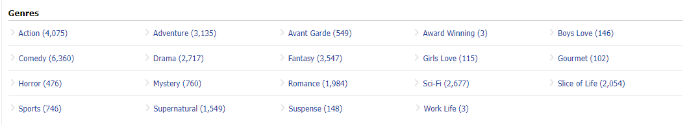
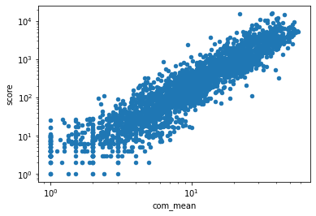
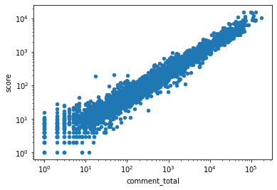
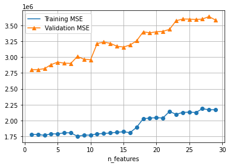
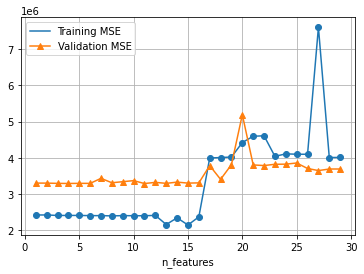

# What's The Hotest Anime in Each Season?


## Abstract

No matter any kind of many screenplays, the most common topics among those watcher or fans are probably:

- Which *xxx* is the best?
- Which *xxx* do you recommend?
- Do you think what's the best *xxx* of 2021?

*xxx* here can be substituted by any type of screenplays, i.e. movies, TV series, TV show and etc. This rule applies to one type of screenplays as well - [TV anime][3].

In this post, I would present with the help the data from [anime community][1] in Reddit and [anime record data][2] to explore what's most welcomed TV animes in different period of time and what are the potential features make them become popular among viewers.

## Background

TV series in US usually have 23-24 episode as a "full season" and many of them run across the fall and winter, in between late September to May of the next year. However, unlike the conventions in North America, anime producers in Japan had very different traditions. The TV animes in Japan are usually played by seasons and last for three months, containing 12-13 episodes:
    
- Winter: January - March
- Spring: April - June
- Summer: July - September
- Fall: October - December

Each season, there would be around 40 - 60 animes get released and each year, there would be more than 350 TV anime produced. 

Besides, the genres of the animes could very rich, covering a lot of topics and multiple themes.



[1]: https://www.reddit.com/r/anime/ "Reddit Anime"
[2]: https://github.com/manami-project/anime-offline-database	"anime-offline-database"
[3]: https://en.wikipedia.org/wiki/Anime "Anime Wiki Page"


## Finding the Hotest Anime in Different Period

### How to Extract the Data We Want?

First of all, we need to determine what submissions are we actually want. Unlike IMDB or Rotten Tomatoes, there is no individual page in reddit for each anime so that people would only discuss or review that specific work under such page. The topics could be relatively spare and board. This can be also proved by a word cloud.


```python
from wordcloud import WordCloud
import matplotlib.pyplot as plt

wordcloud = WordCloud(width = 1000, height = 600, background_color="white",
                min_font_size = 16, font_step=2)
wordcloud.generate(sub_titles['text'].str.cat(sep=' '))
plt.figure(figsize=(20, 10))
plt.imshow(wordcloud, interpolation='bilinear')
plt.axis("off")
plt.show()
```


    

    
> Word cloud of title data among all submission in anime subreddit from `text_submissions` dataset

From the word cloud we can see that, people discussed a lot topics in this subreddit, including but not limited to plots, characters they like, anime recommendations. It would be difficult for us to determine if they are talking about a specific anime and if they are talking about the animes currently on air or not by simply applying `LatentDirichletAllocation` from scikit-learn. As it's very likely that the model will fail to extract the name of the anime properly.

Fortunately, The moderators of the anime subreddit and other contributors wrote a post bot[4] which monitors the latest streaming info and will create a post automatically for each episode of anime after it's released. And this is bot is currently operates under the account *AutoLovepon*.


> A typical discussion submission created by this bot

[4]: https://github.com/r-anime/holo "holo"


Then we can simple go through the full data set we have, select the posts created by `AutoLovepon`, and use regex to extract anime title and episode number. Besides, since the full data set only contains meta data, I also used the [praw](https://github.com/praw-dev/praw) library to help obtain the title name from reddit. As a result, we can acquire the data like below:

- `anime`: title of anime
- `created_utc`: date this submission created, which can be used to identify which season this anime belongs to
- `com_mean`, `com_median`, `com_count`: The mean, median of the scores of the comments under this submission and count the total comments
- `score`: The score of this submission


```python
sta_19[sta_19['anime'] == "One Punch Man Season 2"].head()
```


<div>
<style scoped>
    .dataframe tbody tr th:only-of-type {
        vertical-align: middle;
    }

    .dataframe tbody tr th {
        vertical-align: top;
    }

    .dataframe thead th {
        text-align: right;
    }
</style>
<table border="1" class="dataframe">
  <thead>
    <tr style="text-align: right;">
      <th></th>
      <th>id</th>
      <th>created_utc</th>
      <th>anime</th>
      <th>season</th>
      <th>ep</th>
      <th>com_mean</th>
      <th>com_median</th>
      <th>com_count</th>
      <th>score</th>
    </tr>
  </thead>
  <tbody>
    <tr>
      <th>749</th>
      <td>t3_bbatev</td>
      <td>2019-04-09 17:34:10</td>
      <td>One Punch Man Season 2</td>
      <td>2</td>
      <td>1.0</td>
      <td>26.809337</td>
      <td>2.0</td>
      <td>2035.0</td>
      <td>7756</td>
    </tr>
    <tr>
      <th>784</th>
      <td>t3_bdwte2</td>
      <td>2019-04-16 17:40:48</td>
      <td>One Punch Man Season 2</td>
      <td>2</td>
      <td>2.0</td>
      <td>24.634706</td>
      <td>2.0</td>
      <td>1919.0</td>
      <td>3743</td>
    </tr>
    <tr>
      <th>830</th>
      <td>t3_bgja8c</td>
      <td>2019-04-23 17:39:02</td>
      <td>One Punch Man Season 2</td>
      <td>2</td>
      <td>3.0</td>
      <td>42.697674</td>
      <td>3.0</td>
      <td>1290.0</td>
      <td>5468</td>
    </tr>
    <tr>
      <th>881</th>
      <td>t3_bj65ne</td>
      <td>2019-04-30 17:37:40</td>
      <td>One Punch Man Season 2</td>
      <td>2</td>
      <td>4.0</td>
      <td>28.279570</td>
      <td>3.0</td>
      <td>930.0</td>
      <td>3887</td>
    </tr>
    <tr>
      <th>927</th>
      <td>t3_bltood</td>
      <td>2019-05-07 17:42:06</td>
      <td>One Punch Man Season 2</td>
      <td>2</td>
      <td>5.0</td>
      <td>22.986000</td>
      <td>3.0</td>
      <td>1000.0</td>
      <td>2530</td>
    </tr>
  </tbody>
</table>
</div>


### Rank Top 5 Animes of each season

The score of each discussion submission the most obvious data we can use to compare. Thus, we can calculate the mean of each anime's discussion submission's mean and rank them.


```python
import plotly.express as px

top5_by_score = mean_scores.groupby('season').apply(lambda x: x.sort_values(by='score', ascending=False, na_position='first').head(5).reset_index()).droplevel(0)

fig = px.line(
    top5_by_score, 
    x=top5_by_score.index, 
    y='score', 
    color='season', 
    symbol='season', 
    hover_data=['anime'],
    labels={
        "index": "Rank",
        "score": "Mean of Submission Score",
        "season": "Season"
    },
)
fig.show()
```


```python
rank_2019 = rank_seasons(2019)
rank_2019
```


<div>
<style scoped>
    .dataframe tbody tr th:only-of-type {
        vertical-align: middle;
    }

    .dataframe tbody tr th {
        vertical-align: top;
    }

    .dataframe thead th {
        text-align: right;
    }
</style>
<table border="1" class="dataframe">
  <thead>
    <tr style="text-align: right;">
      <th></th>
      <th>anime</th>
      <th>score</th>
      <th>season</th>
    </tr>
  </thead>
  <tbody>
    <tr>
      <th>0</th>
      <td>Kaguya-sama wa Kokurasetai: Tensai-tachi no Re...</td>
      <td>7204.916667</td>
      <td>1</td>
    </tr>
    <tr>
      <th>1</th>
      <td>Mob Psycho 100 Season 2</td>
      <td>6884.000000</td>
      <td>1</td>
    </tr>
    <tr>
      <th>2</th>
      <td>Yakusoku no Neverland</td>
      <td>4324.083333</td>
      <td>1</td>
    </tr>
    <tr>
      <th>3</th>
      <td>Tate no Yuusha no Nariagari</td>
      <td>3800.400000</td>
      <td>1</td>
    </tr>
    <tr>
      <th>4</th>
      <td>Tensei shitara Slime Datta Ken</td>
      <td>3382.166667</td>
      <td>1</td>
    </tr>
    <tr>
      <th>0</th>
      <td>Shingeki no Kyojin Season 3</td>
      <td>10257.600000</td>
      <td>2</td>
    </tr>
    <tr>
      <th>1</th>
      <td>Kimetsu no Yaiba</td>
      <td>4872.259259</td>
      <td>2</td>
    </tr>
    <tr>
      <th>2</th>
      <td>One Punch Man Season 2</td>
      <td>3825.666667</td>
      <td>2</td>
    </tr>
    <tr>
      <th>3</th>
      <td>Isekai Quartet</td>
      <td>2550.916667</td>
      <td>2</td>
    </tr>
    <tr>
      <th>4</th>
      <td>Hitori Bocchi no ○○ Seikatsu</td>
      <td>1643.750000</td>
      <td>2</td>
    </tr>
    <tr>
      <th>0</th>
      <td>Dr. Stone</td>
      <td>4207.291667</td>
      <td>3</td>
    </tr>
    <tr>
      <th>1</th>
      <td>Vinland Saga</td>
      <td>4027.791667</td>
      <td>3</td>
    </tr>
    <tr>
      <th>2</th>
      <td>Enen no Shouboutai</td>
      <td>2533.791667</td>
      <td>3</td>
    </tr>
    <tr>
      <th>3</th>
      <td>Tsuujou Kougeki ga Zentai Kougeki de Ni-kai Ko...</td>
      <td>1760.000000</td>
      <td>3</td>
    </tr>
    <tr>
      <th>4</th>
      <td>Dungeon ni Deai o Motomeru no wa Machigatte Ir...</td>
      <td>1641.583333</td>
      <td>3</td>
    </tr>
    <tr>
      <th>0</th>
      <td>Boku no Hero Academia Season 4</td>
      <td>4608.181818</td>
      <td>4</td>
    </tr>
    <tr>
      <th>1</th>
      <td>Sword Art Online: Alicization - War of Underworld</td>
      <td>2264.833333</td>
      <td>4</td>
    </tr>
    <tr>
      <th>2</th>
      <td>Fate/Grand Order: Zettai Majuu Sensen Babylonia</td>
      <td>2143.090909</td>
      <td>4</td>
    </tr>
    <tr>
      <th>3</th>
      <td>Shinchou Yuusha: Kono Yuusha ga Ore Tueee Kuse...</td>
      <td>2067.833333</td>
      <td>4</td>
    </tr>
    <tr>
      <th>4</th>
      <td>Ore o Suki na no wa Omae Dake ka yo</td>
      <td>1840.363636</td>
      <td>4</td>
    </tr>
  </tbody>
</table>
</div>


```python
rank_2020 = rank_seasons(2020)
rank_2020
```


<div>
<style scoped>
    .dataframe tbody tr th:only-of-type {
        vertical-align: middle;
    }

    .dataframe tbody tr th {
        vertical-align: top;
    }

    .dataframe thead th {
        text-align: right;
    }
</style>
<table border="1" class="dataframe">
  <thead>
    <tr style="text-align: right;">
      <th></th>
      <th>anime</th>
      <th>score</th>
      <th>season</th>
    </tr>
  </thead>
  <tbody>
    <tr>
      <th>0</th>
      <td>Boku no Hero Academia Season 4</td>
      <td>4224.571429</td>
      <td>1</td>
    </tr>
    <tr>
      <th>1</th>
      <td>Fate/Grand Order: Zettai Majuu Sensen Babylonia</td>
      <td>2351.200000</td>
      <td>1</td>
    </tr>
    <tr>
      <th>2</th>
      <td>Eizouken ni wa Te wo Dasu na!</td>
      <td>2117.833333</td>
      <td>1</td>
    </tr>
    <tr>
      <th>3</th>
      <td>Itai no wa Iya nano de Bougyoryoku ni Kyokufur...</td>
      <td>2000.166667</td>
      <td>1</td>
    </tr>
    <tr>
      <th>4</th>
      <td>Haikyuu!! To the Top</td>
      <td>1984.384615</td>
      <td>1</td>
    </tr>
    <tr>
      <th>0</th>
      <td>Kaguya-sama wa Kokurasetai?: Tensai-tachi no R...</td>
      <td>10105.000000</td>
      <td>2</td>
    </tr>
    <tr>
      <th>1</th>
      <td>Kaguya-sama wa Kokurasetai?: Tensai-tachi no R...</td>
      <td>9362.000000</td>
      <td>2</td>
    </tr>
    <tr>
      <th>2</th>
      <td>Kami no Tou</td>
      <td>8229.000000</td>
      <td>2</td>
    </tr>
    <tr>
      <th>3</th>
      <td>Kami no Tou: Tower of God</td>
      <td>8040.500000</td>
      <td>2</td>
    </tr>
    <tr>
      <th>4</th>
      <td>Otome Game no Hametsu Flag shika Nai Akuyaku R...</td>
      <td>3128.000000</td>
      <td>2</td>
    </tr>
    <tr>
      <th>0</th>
      <td>Re:Zero kara Hajimeru Isekai Seikatsu Season 2</td>
      <td>12289.615385</td>
      <td>3</td>
    </tr>
    <tr>
      <th>1</th>
      <td>Yahari Ore no Seishun Love Comedy wa Machigatt...</td>
      <td>6253.833333</td>
      <td>3</td>
    </tr>
    <tr>
      <th>2</th>
      <td>The God of High School</td>
      <td>4913.384615</td>
      <td>3</td>
    </tr>
    <tr>
      <th>3</th>
      <td>Maou Gakuin no Futekigousha: Shijou Saikyou no...</td>
      <td>3780.916667</td>
      <td>3</td>
    </tr>
    <tr>
      <th>4</th>
      <td>Sword Art Online: Alicization - War of Underwo...</td>
      <td>3347.000000</td>
      <td>3</td>
    </tr>
    <tr>
      <th>0</th>
      <td>Shingeki no Kyojin: The Final Season</td>
      <td>16821.500000</td>
      <td>4</td>
    </tr>
    <tr>
      <th>1</th>
      <td>Jujutsu Kaisen</td>
      <td>6458.266667</td>
      <td>4</td>
    </tr>
    <tr>
      <th>2</th>
      <td>Haikyuu!! To the Top 2nd Season</td>
      <td>4450.000000</td>
      <td>4</td>
    </tr>
    <tr>
      <th>3</th>
      <td>Haikyuu!!: To the Top Part 2</td>
      <td>2831.363636</td>
      <td>4</td>
    </tr>
    <tr>
      <th>4</th>
      <td>Higurashi no Naku Koro ni [Reboot only thread]</td>
      <td>2758.666667</td>
      <td>4</td>
    </tr>
  </tbody>
</table>
</div>


```python
rank_2021 = rank_seasons(2021)
rank_2021
```


<div>
<style scoped>
    .dataframe tbody tr th:only-of-type {
        vertical-align: middle;
    }

    .dataframe tbody tr th {
        vertical-align: top;
    }

    .dataframe thead th {
        text-align: right;
    }
</style>
<table border="1" class="dataframe">
  <thead>
    <tr style="text-align: right;">
      <th></th>
      <th>anime</th>
      <th>score</th>
      <th>season</th>
    </tr>
  </thead>
  <tbody>
    <tr>
      <th>0</th>
      <td>Shingeki no Kyojin: The Final Season</td>
      <td>18219.307692</td>
      <td>1</td>
    </tr>
    <tr>
      <th>1</th>
      <td>Re:Zero kara Hajimeru Isekai Seikatsu Season 2...</td>
      <td>12320.250000</td>
      <td>1</td>
    </tr>
    <tr>
      <th>2</th>
      <td>Jujutsu Kaisen</td>
      <td>10981.727273</td>
      <td>1</td>
    </tr>
    <tr>
      <th>3</th>
      <td>Mushoku Tensei: Isekai Ittara Honki Dasu</td>
      <td>8043.727273</td>
      <td>1</td>
    </tr>
    <tr>
      <th>4</th>
      <td>Horimiya</td>
      <td>6959.461538</td>
      <td>1</td>
    </tr>
    <tr>
      <th>0</th>
      <td>86 EIGHTY-SIX</td>
      <td>7757.090909</td>
      <td>2</td>
    </tr>
    <tr>
      <th>1</th>
      <td>Vivy: Fluorite Eye's Song</td>
      <td>5536.461538</td>
      <td>2</td>
    </tr>
    <tr>
      <th>2</th>
      <td>Fumetsu no Anata e</td>
      <td>5449.750000</td>
      <td>2</td>
    </tr>
    <tr>
      <th>3</th>
      <td>Ijiranaide, Nagatoro-san</td>
      <td>4158.750000</td>
      <td>2</td>
    </tr>
    <tr>
      <th>4</th>
      <td>Hige wo Soru. Soshite Joshikousei wo Hirou.</td>
      <td>3315.076923</td>
      <td>2</td>
    </tr>
  </tbody>
</table>
</div>


Since we have both score of a submission and score of a comments, I ranked the animes with

* mean of each submission's score


```python
import plotly.express as px
import plotly.io as pio 
pio.renderers.default='notebook'

top5_by_score = mean_scores.groupby('season').apply(lambda x: x.sort_values(by='score', ascending=False, na_position='first').head(5).reset_index()).droplevel(0)

fig_1 = px.line(
    top5_by_score, 
    x=top5_by_score.index, 
    y='score', 
    color='season', 
    symbol='season', 
    hover_data=['anime'],
    labels={
        "index": "Rank",
        "score": "Mean of Submission Score",
        "season": "Season"
    },
)

fig_1.show()
```


        
<script src="https://cdn.plot.ly/plotly-2.6.3.min.js"></script>


<div>                            <div id="6e0829b0-2460-4bb5-ab7c-a13e9574f60d" class="plotly-graph-div" style="height:525px; width:100%;"></div>            <script type="text/javascript">                require(["plotly"], function(Plotly) {                    window.PLOTLYENV=window.PLOTLYENV || {};                                    if (document.getElementById("6e0829b0-2460-4bb5-ab7c-a13e9574f60d")) {                    Plotly.newPlot(                        "6e0829b0-2460-4bb5-ab7c-a13e9574f60d",                        [{"customdata":[["Kaguya-sama wa Kokurasetai: Tensai-tachi no Renai Zunousen"],["Mob Psycho 100 Season 2"],["Yakusoku no Neverland"],["Tate no Yuusha no Nariagari"],["Tensei shitara Slime Datta Ken"]],"hovertemplate":"Season=1<br>Rank=%{x}<br>Mean of Submission Score=%{y}<br>anime=%{customdata[0]}<extra></extra>","legendgroup":"1","line":{"color":"#636efa","dash":"solid"},"marker":{"symbol":"circle"},"mode":"lines+markers","name":"1","orientation":"v","showlegend":true,"x":[0,1,2,3,4],"xaxis":"x","y":[7204.916666666667,6884.0,4324.083333333333,3800.4,3382.1666666666665],"yaxis":"y","type":"scatter"},{"customdata":[["Shingeki no Kyojin Season 3"],["Kimetsu no Yaiba"],["One Punch Man Season 2"],["Isekai Quartet"],["Hitori Bocchi no \u25cb\u25cb Seikatsu"]],"hovertemplate":"Season=2<br>Rank=%{x}<br>Mean of Submission Score=%{y}<br>anime=%{customdata[0]}<extra></extra>","legendgroup":"2","line":{"color":"#EF553B","dash":"solid"},"marker":{"symbol":"diamond"},"mode":"lines+markers","name":"2","orientation":"v","showlegend":true,"x":[0,1,2,3,4],"xaxis":"x","y":[10257.6,4872.259259259259,3825.6666666666665,2550.9166666666665,1643.75],"yaxis":"y","type":"scatter"},{"customdata":[["Dr. Stone"],["Vinland Saga"],["Enen no Shouboutai"],["Tsuujou Kougeki ga Zentai Kougeki de Ni-kai Kougeki no Okaasan wa Suki Desu ka?"],["Dungeon ni Deai o Motomeru no wa Machigatte Iru Darouka: Familia Myth Season 2"]],"hovertemplate":"Season=3<br>Rank=%{x}<br>Mean of Submission Score=%{y}<br>anime=%{customdata[0]}<extra></extra>","legendgroup":"3","line":{"color":"#00cc96","dash":"solid"},"marker":{"symbol":"square"},"mode":"lines+markers","name":"3","orientation":"v","showlegend":true,"x":[0,1,2,3,4],"xaxis":"x","y":[4207.291666666667,4027.7916666666665,2533.7916666666665,1760.0,1641.5833333333333],"yaxis":"y","type":"scatter"},{"customdata":[["Boku no Hero Academia Season 4"],["Sword Art Online: Alicization - War of Underworld"],["Fate/Grand Order: Zettai Majuu Sensen Babylonia"],["Shinchou Yuusha: Kono Yuusha ga Ore Tueee Kuse ni Shinchou Sugiru"],["Ore o Suki na no wa Omae Dake ka yo"]],"hovertemplate":"Season=4<br>Rank=%{x}<br>Mean of Submission Score=%{y}<br>anime=%{customdata[0]}<extra></extra>","legendgroup":"4","line":{"color":"#ab63fa","dash":"solid"},"marker":{"symbol":"x"},"mode":"lines+markers","name":"4","orientation":"v","showlegend":true,"x":[0,1,2,3,4],"xaxis":"x","y":[4608.181818181818,2264.8333333333335,2143.090909090909,2067.8333333333335,1840.3636363636363],"yaxis":"y","type":"scatter"}],                        {"template":{"data":{"bar":[{"error_x":{"color":"#2a3f5f"},"error_y":{"color":"#2a3f5f"},"marker":{"line":{"color":"#E5ECF6","width":0.5},"pattern":{"fillmode":"overlay","size":10,"solidity":0.2}},"type":"bar"}],"barpolar":[{"marker":{"line":{"color":"#E5ECF6","width":0.5},"pattern":{"fillmode":"overlay","size":10,"solidity":0.2}},"type":"barpolar"}],"carpet":[{"aaxis":{"endlinecolor":"#2a3f5f","gridcolor":"white","linecolor":"white","minorgridcolor":"white","startlinecolor":"#2a3f5f"},"baxis":{"endlinecolor":"#2a3f5f","gridcolor":"white","linecolor":"white","minorgridcolor":"white","startlinecolor":"#2a3f5f"},"type":"carpet"}],"choropleth":[{"colorbar":{"outlinewidth":0,"ticks":""},"type":"choropleth"}],"contour":[{"colorbar":{"outlinewidth":0,"ticks":""},"colorscale":[[0.0,"#0d0887"],[0.1111111111111111,"#46039f"],[0.2222222222222222,"#7201a8"],[0.3333333333333333,"#9c179e"],[0.4444444444444444,"#bd3786"],[0.5555555555555556,"#d8576b"],[0.6666666666666666,"#ed7953"],[0.7777777777777778,"#fb9f3a"],[0.8888888888888888,"#fdca26"],[1.0,"#f0f921"]],"type":"contour"}],"contourcarpet":[{"colorbar":{"outlinewidth":0,"ticks":""},"type":"contourcarpet"}],"heatmap":[{"colorbar":{"outlinewidth":0,"ticks":""},"colorscale":[[0.0,"#0d0887"],[0.1111111111111111,"#46039f"],[0.2222222222222222,"#7201a8"],[0.3333333333333333,"#9c179e"],[0.4444444444444444,"#bd3786"],[0.5555555555555556,"#d8576b"],[0.6666666666666666,"#ed7953"],[0.7777777777777778,"#fb9f3a"],[0.8888888888888888,"#fdca26"],[1.0,"#f0f921"]],"type":"heatmap"}],"heatmapgl":[{"colorbar":{"outlinewidth":0,"ticks":""},"colorscale":[[0.0,"#0d0887"],[0.1111111111111111,"#46039f"],[0.2222222222222222,"#7201a8"],[0.3333333333333333,"#9c179e"],[0.4444444444444444,"#bd3786"],[0.5555555555555556,"#d8576b"],[0.6666666666666666,"#ed7953"],[0.7777777777777778,"#fb9f3a"],[0.8888888888888888,"#fdca26"],[1.0,"#f0f921"]],"type":"heatmapgl"}],"histogram":[{"marker":{"pattern":{"fillmode":"overlay","size":10,"solidity":0.2}},"type":"histogram"}],"histogram2d":[{"colorbar":{"outlinewidth":0,"ticks":""},"colorscale":[[0.0,"#0d0887"],[0.1111111111111111,"#46039f"],[0.2222222222222222,"#7201a8"],[0.3333333333333333,"#9c179e"],[0.4444444444444444,"#bd3786"],[0.5555555555555556,"#d8576b"],[0.6666666666666666,"#ed7953"],[0.7777777777777778,"#fb9f3a"],[0.8888888888888888,"#fdca26"],[1.0,"#f0f921"]],"type":"histogram2d"}],"histogram2dcontour":[{"colorbar":{"outlinewidth":0,"ticks":""},"colorscale":[[0.0,"#0d0887"],[0.1111111111111111,"#46039f"],[0.2222222222222222,"#7201a8"],[0.3333333333333333,"#9c179e"],[0.4444444444444444,"#bd3786"],[0.5555555555555556,"#d8576b"],[0.6666666666666666,"#ed7953"],[0.7777777777777778,"#fb9f3a"],[0.8888888888888888,"#fdca26"],[1.0,"#f0f921"]],"type":"histogram2dcontour"}],"mesh3d":[{"colorbar":{"outlinewidth":0,"ticks":""},"type":"mesh3d"}],"parcoords":[{"line":{"colorbar":{"outlinewidth":0,"ticks":""}},"type":"parcoords"}],"pie":[{"automargin":true,"type":"pie"}],"scatter":[{"marker":{"colorbar":{"outlinewidth":0,"ticks":""}},"type":"scatter"}],"scatter3d":[{"line":{"colorbar":{"outlinewidth":0,"ticks":""}},"marker":{"colorbar":{"outlinewidth":0,"ticks":""}},"type":"scatter3d"}],"scattercarpet":[{"marker":{"colorbar":{"outlinewidth":0,"ticks":""}},"type":"scattercarpet"}],"scattergeo":[{"marker":{"colorbar":{"outlinewidth":0,"ticks":""}},"type":"scattergeo"}],"scattergl":[{"marker":{"colorbar":{"outlinewidth":0,"ticks":""}},"type":"scattergl"}],"scattermapbox":[{"marker":{"colorbar":{"outlinewidth":0,"ticks":""}},"type":"scattermapbox"}],"scatterpolar":[{"marker":{"colorbar":{"outlinewidth":0,"ticks":""}},"type":"scatterpolar"}],"scatterpolargl":[{"marker":{"colorbar":{"outlinewidth":0,"ticks":""}},"type":"scatterpolargl"}],"scatterternary":[{"marker":{"colorbar":{"outlinewidth":0,"ticks":""}},"type":"scatterternary"}],"surface":[{"colorbar":{"outlinewidth":0,"ticks":""},"colorscale":[[0.0,"#0d0887"],[0.1111111111111111,"#46039f"],[0.2222222222222222,"#7201a8"],[0.3333333333333333,"#9c179e"],[0.4444444444444444,"#bd3786"],[0.5555555555555556,"#d8576b"],[0.6666666666666666,"#ed7953"],[0.7777777777777778,"#fb9f3a"],[0.8888888888888888,"#fdca26"],[1.0,"#f0f921"]],"type":"surface"}],"table":[{"cells":{"fill":{"color":"#EBF0F8"},"line":{"color":"white"}},"header":{"fill":{"color":"#C8D4E3"},"line":{"color":"white"}},"type":"table"}]},"layout":{"annotationdefaults":{"arrowcolor":"#2a3f5f","arrowhead":0,"arrowwidth":1},"autotypenumbers":"strict","coloraxis":{"colorbar":{"outlinewidth":0,"ticks":""}},"colorscale":{"diverging":[[0,"#8e0152"],[0.1,"#c51b7d"],[0.2,"#de77ae"],[0.3,"#f1b6da"],[0.4,"#fde0ef"],[0.5,"#f7f7f7"],[0.6,"#e6f5d0"],[0.7,"#b8e186"],[0.8,"#7fbc41"],[0.9,"#4d9221"],[1,"#276419"]],"sequential":[[0.0,"#0d0887"],[0.1111111111111111,"#46039f"],[0.2222222222222222,"#7201a8"],[0.3333333333333333,"#9c179e"],[0.4444444444444444,"#bd3786"],[0.5555555555555556,"#d8576b"],[0.6666666666666666,"#ed7953"],[0.7777777777777778,"#fb9f3a"],[0.8888888888888888,"#fdca26"],[1.0,"#f0f921"]],"sequentialminus":[[0.0,"#0d0887"],[0.1111111111111111,"#46039f"],[0.2222222222222222,"#7201a8"],[0.3333333333333333,"#9c179e"],[0.4444444444444444,"#bd3786"],[0.5555555555555556,"#d8576b"],[0.6666666666666666,"#ed7953"],[0.7777777777777778,"#fb9f3a"],[0.8888888888888888,"#fdca26"],[1.0,"#f0f921"]]},"colorway":["#636efa","#EF553B","#00cc96","#ab63fa","#FFA15A","#19d3f3","#FF6692","#B6E880","#FF97FF","#FECB52"],"font":{"color":"#2a3f5f"},"geo":{"bgcolor":"white","lakecolor":"white","landcolor":"#E5ECF6","showlakes":true,"showland":true,"subunitcolor":"white"},"hoverlabel":{"align":"left"},"hovermode":"closest","mapbox":{"style":"light"},"paper_bgcolor":"white","plot_bgcolor":"#E5ECF6","polar":{"angularaxis":{"gridcolor":"white","linecolor":"white","ticks":""},"bgcolor":"#E5ECF6","radialaxis":{"gridcolor":"white","linecolor":"white","ticks":""}},"scene":{"xaxis":{"backgroundcolor":"#E5ECF6","gridcolor":"white","gridwidth":2,"linecolor":"white","showbackground":true,"ticks":"","zerolinecolor":"white"},"yaxis":{"backgroundcolor":"#E5ECF6","gridcolor":"white","gridwidth":2,"linecolor":"white","showbackground":true,"ticks":"","zerolinecolor":"white"},"zaxis":{"backgroundcolor":"#E5ECF6","gridcolor":"white","gridwidth":2,"linecolor":"white","showbackground":true,"ticks":"","zerolinecolor":"white"}},"shapedefaults":{"line":{"color":"#2a3f5f"}},"ternary":{"aaxis":{"gridcolor":"white","linecolor":"white","ticks":""},"baxis":{"gridcolor":"white","linecolor":"white","ticks":""},"bgcolor":"#E5ECF6","caxis":{"gridcolor":"white","linecolor":"white","ticks":""}},"title":{"x":0.05},"xaxis":{"automargin":true,"gridcolor":"white","linecolor":"white","ticks":"","title":{"standoff":15},"zerolinecolor":"white","zerolinewidth":2},"yaxis":{"automargin":true,"gridcolor":"white","linecolor":"white","ticks":"","title":{"standoff":15},"zerolinecolor":"white","zerolinewidth":2}}},"xaxis":{"anchor":"y","domain":[0.0,1.0],"title":{"text":"Rank"}},"yaxis":{"anchor":"x","domain":[0.0,1.0],"title":{"text":"Mean of Submission Score"}},"legend":{"title":{"text":"Season"},"tracegroupgap":0},"margin":{"t":60}},                        {"responsive": true}                    ).then(function(){

var gd = document.getElementById('6e0829b0-2460-4bb5-ab7c-a13e9574f60d');
var x = new MutationObserver(function (mutations, observer) {{
        var display = window.getComputedStyle(gd).display;
        if (!display || display === 'none') {{
            console.log([gd, 'removed!']);
            Plotly.purge(gd);
            observer.disconnect();
        }}
}});

// Listen for the removal of the full notebook cells
var notebookContainer = gd.closest('#notebook-container');
if (notebookContainer) {{x.observe(notebookContainer, {childList: true});}}

// Listen for the clearing of the current output cell
var outputEl = gd.closest('.output');
if (outputEl) {{x.observe(outputEl, {childList: true});}}

                        })                };                });            </script>        </div>


* mean of total comments' score under the same submission


```python
sta_19.fillna(0, inplace=True)
mean_com_count = sta_19.groupby('anime').agg({'com_count': 'mean', 'season': 'min'})
top5_by_com_count = mean_com_count.groupby('season').apply(lambda x: x.sort_values(by='com_count', ascending=False, na_position='first').reset_index().head(5)).droplevel(0)

fig_2 = px.line(
    top5_by_com_count, 
    x=top5_by_com_count.index, 
    y='com_count', 
    color='season', 
    symbol='season', 
    hover_data=['anime'],
    labels={
        "index": "Rank",
        "com_count": "Mean of comment's count",
        "season": "Season"
    },
)
fig_2.show()

```


<div>                            <div id="365bca89-986f-42f7-ab63-b63228a44e46" class="plotly-graph-div" style="height:525px; width:100%;"></div>            <script type="text/javascript">                require(["plotly"], function(Plotly) {                    window.PLOTLYENV=window.PLOTLYENV || {};                                    if (document.getElementById("365bca89-986f-42f7-ab63-b63228a44e46")) {                    Plotly.newPlot(                        "365bca89-986f-42f7-ab63-b63228a44e46",                        [{"customdata":[["Tate no Yuusha no Nariagari"],["Kaguya-sama wa Kokurasetai: Tensai-tachi no Renai Zunousen"],["Yakusoku no Neverland"],["Mob Psycho 100 Season 2"],["Tensei shitara Slime Datta Ken"]],"hovertemplate":"Season=1<br>Rank=%{x}<br>Mean of comment's count=%{y}<br>anime=%{customdata[0]}<extra></extra>","legendgroup":"1","line":{"color":"#636efa","dash":"solid"},"marker":{"symbol":"circle"},"mode":"lines+markers","name":"1","orientation":"v","showlegend":true,"x":[0,1,2,3,4],"xaxis":"x","y":[1567.32,1400.5833333333333,1215.3333333333333,1170.7692307692307,979.25],"yaxis":"y","type":"scatter"},{"customdata":[["Shingeki no Kyojin Season 3"],["One Punch Man Season 2"],["Kimetsu no Yaiba"],["Isekai Quartet"],["Kenja no Mago"]],"hovertemplate":"Season=2<br>Rank=%{x}<br>Mean of comment's count=%{y}<br>anime=%{customdata[0]}<extra></extra>","legendgroup":"2","line":{"color":"#EF553B","dash":"solid"},"marker":{"symbol":"diamond"},"mode":"lines+markers","name":"2","orientation":"v","showlegend":true,"x":[0,1,2,3,4],"xaxis":"x","y":[2861.6,1164.25,1000.1851851851852,853.9166666666666,390.0],"yaxis":"y","type":"scatter"},{"customdata":[["Dr. Stone"],["Vinland Saga"],["Dungeon ni Deai o Motomeru no wa Machigatte Iru Darouka: Familia Myth Season 2"],["Tsuujou Kougeki ga Zentai Kougeki de Ni-kai Kougeki no Okaasan wa Suki Desu ka?"],["Kanata no Astra"]],"hovertemplate":"Season=3<br>Rank=%{x}<br>Mean of comment's count=%{y}<br>anime=%{customdata[0]}<extra></extra>","legendgroup":"3","line":{"color":"#00cc96","dash":"solid"},"marker":{"symbol":"square"},"mode":"lines+markers","name":"3","orientation":"v","showlegend":true,"x":[0,1,2,3,4],"xaxis":"x","y":[913.4166666666666,739.6666666666666,582.9166666666666,579.0,577.5],"yaxis":"y","type":"scatter"},{"customdata":[["Boku no Hero Academia Season 4"],["Sword Art Online: Alicization - War of Underworld"],["Fate/Grand Order: Zettai Majuu Sensen Babylonia"],["Shinchou Yuusha: Kono Yuusha ga Ore Tueee Kuse ni Shinchou Sugiru"],["Ore o Suki na no wa Omae Dake ka yo"]],"hovertemplate":"Season=4<br>Rank=%{x}<br>Mean of comment's count=%{y}<br>anime=%{customdata[0]}<extra></extra>","legendgroup":"4","line":{"color":"#ab63fa","dash":"solid"},"marker":{"symbol":"x"},"mode":"lines+markers","name":"4","orientation":"v","showlegend":true,"x":[0,1,2,3,4],"xaxis":"x","y":[915.5454545454545,735.5,630.9090909090909,493.3333333333333,435.90909090909093],"yaxis":"y","type":"scatter"}],                        {"template":{"data":{"bar":[{"error_x":{"color":"#2a3f5f"},"error_y":{"color":"#2a3f5f"},"marker":{"line":{"color":"#E5ECF6","width":0.5},"pattern":{"fillmode":"overlay","size":10,"solidity":0.2}},"type":"bar"}],"barpolar":[{"marker":{"line":{"color":"#E5ECF6","width":0.5},"pattern":{"fillmode":"overlay","size":10,"solidity":0.2}},"type":"barpolar"}],"carpet":[{"aaxis":{"endlinecolor":"#2a3f5f","gridcolor":"white","linecolor":"white","minorgridcolor":"white","startlinecolor":"#2a3f5f"},"baxis":{"endlinecolor":"#2a3f5f","gridcolor":"white","linecolor":"white","minorgridcolor":"white","startlinecolor":"#2a3f5f"},"type":"carpet"}],"choropleth":[{"colorbar":{"outlinewidth":0,"ticks":""},"type":"choropleth"}],"contour":[{"colorbar":{"outlinewidth":0,"ticks":""},"colorscale":[[0.0,"#0d0887"],[0.1111111111111111,"#46039f"],[0.2222222222222222,"#7201a8"],[0.3333333333333333,"#9c179e"],[0.4444444444444444,"#bd3786"],[0.5555555555555556,"#d8576b"],[0.6666666666666666,"#ed7953"],[0.7777777777777778,"#fb9f3a"],[0.8888888888888888,"#fdca26"],[1.0,"#f0f921"]],"type":"contour"}],"contourcarpet":[{"colorbar":{"outlinewidth":0,"ticks":""},"type":"contourcarpet"}],"heatmap":[{"colorbar":{"outlinewidth":0,"ticks":""},"colorscale":[[0.0,"#0d0887"],[0.1111111111111111,"#46039f"],[0.2222222222222222,"#7201a8"],[0.3333333333333333,"#9c179e"],[0.4444444444444444,"#bd3786"],[0.5555555555555556,"#d8576b"],[0.6666666666666666,"#ed7953"],[0.7777777777777778,"#fb9f3a"],[0.8888888888888888,"#fdca26"],[1.0,"#f0f921"]],"type":"heatmap"}],"heatmapgl":[{"colorbar":{"outlinewidth":0,"ticks":""},"colorscale":[[0.0,"#0d0887"],[0.1111111111111111,"#46039f"],[0.2222222222222222,"#7201a8"],[0.3333333333333333,"#9c179e"],[0.4444444444444444,"#bd3786"],[0.5555555555555556,"#d8576b"],[0.6666666666666666,"#ed7953"],[0.7777777777777778,"#fb9f3a"],[0.8888888888888888,"#fdca26"],[1.0,"#f0f921"]],"type":"heatmapgl"}],"histogram":[{"marker":{"pattern":{"fillmode":"overlay","size":10,"solidity":0.2}},"type":"histogram"}],"histogram2d":[{"colorbar":{"outlinewidth":0,"ticks":""},"colorscale":[[0.0,"#0d0887"],[0.1111111111111111,"#46039f"],[0.2222222222222222,"#7201a8"],[0.3333333333333333,"#9c179e"],[0.4444444444444444,"#bd3786"],[0.5555555555555556,"#d8576b"],[0.6666666666666666,"#ed7953"],[0.7777777777777778,"#fb9f3a"],[0.8888888888888888,"#fdca26"],[1.0,"#f0f921"]],"type":"histogram2d"}],"histogram2dcontour":[{"colorbar":{"outlinewidth":0,"ticks":""},"colorscale":[[0.0,"#0d0887"],[0.1111111111111111,"#46039f"],[0.2222222222222222,"#7201a8"],[0.3333333333333333,"#9c179e"],[0.4444444444444444,"#bd3786"],[0.5555555555555556,"#d8576b"],[0.6666666666666666,"#ed7953"],[0.7777777777777778,"#fb9f3a"],[0.8888888888888888,"#fdca26"],[1.0,"#f0f921"]],"type":"histogram2dcontour"}],"mesh3d":[{"colorbar":{"outlinewidth":0,"ticks":""},"type":"mesh3d"}],"parcoords":[{"line":{"colorbar":{"outlinewidth":0,"ticks":""}},"type":"parcoords"}],"pie":[{"automargin":true,"type":"pie"}],"scatter":[{"marker":{"colorbar":{"outlinewidth":0,"ticks":""}},"type":"scatter"}],"scatter3d":[{"line":{"colorbar":{"outlinewidth":0,"ticks":""}},"marker":{"colorbar":{"outlinewidth":0,"ticks":""}},"type":"scatter3d"}],"scattercarpet":[{"marker":{"colorbar":{"outlinewidth":0,"ticks":""}},"type":"scattercarpet"}],"scattergeo":[{"marker":{"colorbar":{"outlinewidth":0,"ticks":""}},"type":"scattergeo"}],"scattergl":[{"marker":{"colorbar":{"outlinewidth":0,"ticks":""}},"type":"scattergl"}],"scattermapbox":[{"marker":{"colorbar":{"outlinewidth":0,"ticks":""}},"type":"scattermapbox"}],"scatterpolar":[{"marker":{"colorbar":{"outlinewidth":0,"ticks":""}},"type":"scatterpolar"}],"scatterpolargl":[{"marker":{"colorbar":{"outlinewidth":0,"ticks":""}},"type":"scatterpolargl"}],"scatterternary":[{"marker":{"colorbar":{"outlinewidth":0,"ticks":""}},"type":"scatterternary"}],"surface":[{"colorbar":{"outlinewidth":0,"ticks":""},"colorscale":[[0.0,"#0d0887"],[0.1111111111111111,"#46039f"],[0.2222222222222222,"#7201a8"],[0.3333333333333333,"#9c179e"],[0.4444444444444444,"#bd3786"],[0.5555555555555556,"#d8576b"],[0.6666666666666666,"#ed7953"],[0.7777777777777778,"#fb9f3a"],[0.8888888888888888,"#fdca26"],[1.0,"#f0f921"]],"type":"surface"}],"table":[{"cells":{"fill":{"color":"#EBF0F8"},"line":{"color":"white"}},"header":{"fill":{"color":"#C8D4E3"},"line":{"color":"white"}},"type":"table"}]},"layout":{"annotationdefaults":{"arrowcolor":"#2a3f5f","arrowhead":0,"arrowwidth":1},"autotypenumbers":"strict","coloraxis":{"colorbar":{"outlinewidth":0,"ticks":""}},"colorscale":{"diverging":[[0,"#8e0152"],[0.1,"#c51b7d"],[0.2,"#de77ae"],[0.3,"#f1b6da"],[0.4,"#fde0ef"],[0.5,"#f7f7f7"],[0.6,"#e6f5d0"],[0.7,"#b8e186"],[0.8,"#7fbc41"],[0.9,"#4d9221"],[1,"#276419"]],"sequential":[[0.0,"#0d0887"],[0.1111111111111111,"#46039f"],[0.2222222222222222,"#7201a8"],[0.3333333333333333,"#9c179e"],[0.4444444444444444,"#bd3786"],[0.5555555555555556,"#d8576b"],[0.6666666666666666,"#ed7953"],[0.7777777777777778,"#fb9f3a"],[0.8888888888888888,"#fdca26"],[1.0,"#f0f921"]],"sequentialminus":[[0.0,"#0d0887"],[0.1111111111111111,"#46039f"],[0.2222222222222222,"#7201a8"],[0.3333333333333333,"#9c179e"],[0.4444444444444444,"#bd3786"],[0.5555555555555556,"#d8576b"],[0.6666666666666666,"#ed7953"],[0.7777777777777778,"#fb9f3a"],[0.8888888888888888,"#fdca26"],[1.0,"#f0f921"]]},"colorway":["#636efa","#EF553B","#00cc96","#ab63fa","#FFA15A","#19d3f3","#FF6692","#B6E880","#FF97FF","#FECB52"],"font":{"color":"#2a3f5f"},"geo":{"bgcolor":"white","lakecolor":"white","landcolor":"#E5ECF6","showlakes":true,"showland":true,"subunitcolor":"white"},"hoverlabel":{"align":"left"},"hovermode":"closest","mapbox":{"style":"light"},"paper_bgcolor":"white","plot_bgcolor":"#E5ECF6","polar":{"angularaxis":{"gridcolor":"white","linecolor":"white","ticks":""},"bgcolor":"#E5ECF6","radialaxis":{"gridcolor":"white","linecolor":"white","ticks":""}},"scene":{"xaxis":{"backgroundcolor":"#E5ECF6","gridcolor":"white","gridwidth":2,"linecolor":"white","showbackground":true,"ticks":"","zerolinecolor":"white"},"yaxis":{"backgroundcolor":"#E5ECF6","gridcolor":"white","gridwidth":2,"linecolor":"white","showbackground":true,"ticks":"","zerolinecolor":"white"},"zaxis":{"backgroundcolor":"#E5ECF6","gridcolor":"white","gridwidth":2,"linecolor":"white","showbackground":true,"ticks":"","zerolinecolor":"white"}},"shapedefaults":{"line":{"color":"#2a3f5f"}},"ternary":{"aaxis":{"gridcolor":"white","linecolor":"white","ticks":""},"baxis":{"gridcolor":"white","linecolor":"white","ticks":""},"bgcolor":"#E5ECF6","caxis":{"gridcolor":"white","linecolor":"white","ticks":""}},"title":{"x":0.05},"xaxis":{"automargin":true,"gridcolor":"white","linecolor":"white","ticks":"","title":{"standoff":15},"zerolinecolor":"white","zerolinewidth":2},"yaxis":{"automargin":true,"gridcolor":"white","linecolor":"white","ticks":"","title":{"standoff":15},"zerolinecolor":"white","zerolinewidth":2}}},"xaxis":{"anchor":"y","domain":[0.0,1.0],"title":{"text":"Rank"}},"yaxis":{"anchor":"x","domain":[0.0,1.0],"title":{"text":"Mean of comment's count"}},"legend":{"title":{"text":"Season"},"tracegroupgap":0},"margin":{"t":60}},                        {"responsive": true}                    ).then(function(){

var gd = document.getElementById('365bca89-986f-42f7-ab63-b63228a44e46');
var x = new MutationObserver(function (mutations, observer) {{
        var display = window.getComputedStyle(gd).display;
        if (!display || display === 'none') {{
            console.log([gd, 'removed!']);
            Plotly.purge(gd);
            observer.disconnect();
        }}
}});

// Listen for the removal of the full notebook cells
var notebookContainer = gd.closest('#notebook-container');
if (notebookContainer) {{
    x.observe(notebookContainer, {childList: true});
}}

// Listen for the clearing of the current output cell
var outputEl = gd.closest('.output');
if (outputEl) {{
    x.observe(outputEl, {childList: true});
}}

                        })                };                });            </script>        </div>


* median of total comments' score under the same submission


```python
med_com_score = sta_19.groupby('anime').agg({'com_median': 'mean', 'season': 'min'})
top5_by_com_score_med = med_com_score.groupby('season').apply(lambda x: x.sort_values(by='com_median', ascending=False, na_position='first').reset_index().head(5)).droplevel(0)

fig_3 = px.line(
    top5_by_com_score_med, 
    x=top5_by_com_score_med.index, 
    y='com_median', 
    color='season', 
    symbol='season', 
    hover_data=['anime'],
    labels={
        "index": "Rank",
        "com_median": "Median of comment's Score",
        "season": "Season"
    },
)
fig_3.show()
```


<div>                            <div id="9bf8e2f0-6b7f-4a3e-bb6c-26eee915c12f" class="plotly-graph-div" style="height:525px; width:100%;"></div>            <script type="text/javascript">                require(["plotly"], function(Plotly) {                    window.PLOTLYENV=window.PLOTLYENV || {};                                    if (document.getElementById("9bf8e2f0-6b7f-4a3e-bb6c-26eee915c12f")) {                    Plotly.newPlot(                        "9bf8e2f0-6b7f-4a3e-bb6c-26eee915c12f",                        [{"customdata":[["Emiya-San Chi no Kyou no Gohan"],["Endro~!"],["Ueno-san wa Bukiyou"],["Watashi ni Tenshi ga Maiorita!"],["Kaze ga Tsuyoku Fuite Iru"]],"hovertemplate":"Season=1<br>Rank=%{x}<br>Median of comment's Score=%{y}<br>anime=%{customdata[0]}<extra></extra>","legendgroup":"1","line":{"color":"#636efa","dash":"solid"},"marker":{"symbol":"circle"},"mode":"lines+markers","name":"1","orientation":"v","showlegend":true,"x":[0,1,2,3,4],"xaxis":"x","y":[9.0,8.708333333333334,8.375,8.307692307692308,6.75],"yaxis":"y","type":"scatter"},{"customdata":[["Hitori Bocchi no \u25cb\u25cb Seikatsu"],["Miru Tights"],["Fruits Basket"],["Sarazanmai"],["Joshi Kausei"]],"hovertemplate":"Season=2<br>Rank=%{x}<br>Median of comment's Score=%{y}<br>anime=%{customdata[0]}<extra></extra>","legendgroup":"2","line":{"color":"#EF553B","dash":"solid"},"marker":{"symbol":"diamond"},"mode":"lines+markers","name":"2","orientation":"v","showlegend":true,"x":[0,1,2,3,4],"xaxis":"x","y":[9.333333333333334,8.642857142857142,8.6,8.545454545454545,8.26923076923077],"yaxis":"y","type":"scatter"},{"customdata":[["Machikado Mazoku"],["Given"],["Joshikousei no Mudazukai"],["Tejina Senpai"],["Mini Yuri"]],"hovertemplate":"Season=3<br>Rank=%{x}<br>Median of comment's Score=%{y}<br>anime=%{customdata[0]}<extra></extra>","legendgroup":"3","line":{"color":"#00cc96","dash":"solid"},"marker":{"symbol":"square"},"mode":"lines+markers","name":"3","orientation":"v","showlegend":true,"x":[0,1,2,3,4],"xaxis":"x","y":[10.916666666666666,10.181818181818182,10.125,8.875,8.375],"yaxis":"y","type":"scatter"},{"customdata":[["Saiki Kusuo no \u03a8-nan: Shidou-hen"],["Mairimashita! Iruma-kun"],["Chihayafuru Season 3"],["Beastars"],["Babylon"]],"hovertemplate":"Season=4<br>Rank=%{x}<br>Median of comment's Score=%{y}<br>anime=%{customdata[0]}<extra></extra>","legendgroup":"4","line":{"color":"#ab63fa","dash":"solid"},"marker":{"symbol":"x"},"mode":"lines+markers","name":"4","orientation":"v","showlegend":true,"x":[0,1,2,3,4],"xaxis":"x","y":[16.416666666666668,12.0,9.375,8.208333333333334,7.9375],"yaxis":"y","type":"scatter"}],                        {"template":{"data":{"bar":[{"error_x":{"color":"#2a3f5f"},"error_y":{"color":"#2a3f5f"},"marker":{"line":{"color":"#E5ECF6","width":0.5},"pattern":{"fillmode":"overlay","size":10,"solidity":0.2}},"type":"bar"}],"barpolar":[{"marker":{"line":{"color":"#E5ECF6","width":0.5},"pattern":{"fillmode":"overlay","size":10,"solidity":0.2}},"type":"barpolar"}],"carpet":[{"aaxis":{"endlinecolor":"#2a3f5f","gridcolor":"white","linecolor":"white","minorgridcolor":"white","startlinecolor":"#2a3f5f"},"baxis":{"endlinecolor":"#2a3f5f","gridcolor":"white","linecolor":"white","minorgridcolor":"white","startlinecolor":"#2a3f5f"},"type":"carpet"}],"choropleth":[{"colorbar":{"outlinewidth":0,"ticks":""},"type":"choropleth"}],"contour":[{"colorbar":{"outlinewidth":0,"ticks":""},"colorscale":[[0.0,"#0d0887"],[0.1111111111111111,"#46039f"],[0.2222222222222222,"#7201a8"],[0.3333333333333333,"#9c179e"],[0.4444444444444444,"#bd3786"],[0.5555555555555556,"#d8576b"],[0.6666666666666666,"#ed7953"],[0.7777777777777778,"#fb9f3a"],[0.8888888888888888,"#fdca26"],[1.0,"#f0f921"]],"type":"contour"}],"contourcarpet":[{"colorbar":{"outlinewidth":0,"ticks":""},"type":"contourcarpet"}],"heatmap":[{"colorbar":{"outlinewidth":0,"ticks":""},"colorscale":[[0.0,"#0d0887"],[0.1111111111111111,"#46039f"],[0.2222222222222222,"#7201a8"],[0.3333333333333333,"#9c179e"],[0.4444444444444444,"#bd3786"],[0.5555555555555556,"#d8576b"],[0.6666666666666666,"#ed7953"],[0.7777777777777778,"#fb9f3a"],[0.8888888888888888,"#fdca26"],[1.0,"#f0f921"]],"type":"heatmap"}],"heatmapgl":[{"colorbar":{"outlinewidth":0,"ticks":""},"colorscale":[[0.0,"#0d0887"],[0.1111111111111111,"#46039f"],[0.2222222222222222,"#7201a8"],[0.3333333333333333,"#9c179e"],[0.4444444444444444,"#bd3786"],[0.5555555555555556,"#d8576b"],[0.6666666666666666,"#ed7953"],[0.7777777777777778,"#fb9f3a"],[0.8888888888888888,"#fdca26"],[1.0,"#f0f921"]],"type":"heatmapgl"}],"histogram":[{"marker":{"pattern":{"fillmode":"overlay","size":10,"solidity":0.2}},"type":"histogram"}],"histogram2d":[{"colorbar":{"outlinewidth":0,"ticks":""},"colorscale":[[0.0,"#0d0887"],[0.1111111111111111,"#46039f"],[0.2222222222222222,"#7201a8"],[0.3333333333333333,"#9c179e"],[0.4444444444444444,"#bd3786"],[0.5555555555555556,"#d8576b"],[0.6666666666666666,"#ed7953"],[0.7777777777777778,"#fb9f3a"],[0.8888888888888888,"#fdca26"],[1.0,"#f0f921"]],"type":"histogram2d"}],"histogram2dcontour":[{"colorbar":{"outlinewidth":0,"ticks":""},"colorscale":[[0.0,"#0d0887"],[0.1111111111111111,"#46039f"],[0.2222222222222222,"#7201a8"],[0.3333333333333333,"#9c179e"],[0.4444444444444444,"#bd3786"],[0.5555555555555556,"#d8576b"],[0.6666666666666666,"#ed7953"],[0.7777777777777778,"#fb9f3a"],[0.8888888888888888,"#fdca26"],[1.0,"#f0f921"]],"type":"histogram2dcontour"}],"mesh3d":[{"colorbar":{"outlinewidth":0,"ticks":""},"type":"mesh3d"}],"parcoords":[{"line":{"colorbar":{"outlinewidth":0,"ticks":""}},"type":"parcoords"}],"pie":[{"automargin":true,"type":"pie"}],"scatter":[{"marker":{"colorbar":{"outlinewidth":0,"ticks":""}},"type":"scatter"}],"scatter3d":[{"line":{"colorbar":{"outlinewidth":0,"ticks":""}},"marker":{"colorbar":{"outlinewidth":0,"ticks":""}},"type":"scatter3d"}],"scattercarpet":[{"marker":{"colorbar":{"outlinewidth":0,"ticks":""}},"type":"scattercarpet"}],"scattergeo":[{"marker":{"colorbar":{"outlinewidth":0,"ticks":""}},"type":"scattergeo"}],"scattergl":[{"marker":{"colorbar":{"outlinewidth":0,"ticks":""}},"type":"scattergl"}],"scattermapbox":[{"marker":{"colorbar":{"outlinewidth":0,"ticks":""}},"type":"scattermapbox"}],"scatterpolar":[{"marker":{"colorbar":{"outlinewidth":0,"ticks":""}},"type":"scatterpolar"}],"scatterpolargl":[{"marker":{"colorbar":{"outlinewidth":0,"ticks":""}},"type":"scatterpolargl"}],"scatterternary":[{"marker":{"colorbar":{"outlinewidth":0,"ticks":""}},"type":"scatterternary"}],"surface":[{"colorbar":{"outlinewidth":0,"ticks":""},"colorscale":[[0.0,"#0d0887"],[0.1111111111111111,"#46039f"],[0.2222222222222222,"#7201a8"],[0.3333333333333333,"#9c179e"],[0.4444444444444444,"#bd3786"],[0.5555555555555556,"#d8576b"],[0.6666666666666666,"#ed7953"],[0.7777777777777778,"#fb9f3a"],[0.8888888888888888,"#fdca26"],[1.0,"#f0f921"]],"type":"surface"}],"table":[{"cells":{"fill":{"color":"#EBF0F8"},"line":{"color":"white"}},"header":{"fill":{"color":"#C8D4E3"},"line":{"color":"white"}},"type":"table"}]},"layout":{"annotationdefaults":{"arrowcolor":"#2a3f5f","arrowhead":0,"arrowwidth":1},"autotypenumbers":"strict","coloraxis":{"colorbar":{"outlinewidth":0,"ticks":""}},"colorscale":{"diverging":[[0,"#8e0152"],[0.1,"#c51b7d"],[0.2,"#de77ae"],[0.3,"#f1b6da"],[0.4,"#fde0ef"],[0.5,"#f7f7f7"],[0.6,"#e6f5d0"],[0.7,"#b8e186"],[0.8,"#7fbc41"],[0.9,"#4d9221"],[1,"#276419"]],"sequential":[[0.0,"#0d0887"],[0.1111111111111111,"#46039f"],[0.2222222222222222,"#7201a8"],[0.3333333333333333,"#9c179e"],[0.4444444444444444,"#bd3786"],[0.5555555555555556,"#d8576b"],[0.6666666666666666,"#ed7953"],[0.7777777777777778,"#fb9f3a"],[0.8888888888888888,"#fdca26"],[1.0,"#f0f921"]],"sequentialminus":[[0.0,"#0d0887"],[0.1111111111111111,"#46039f"],[0.2222222222222222,"#7201a8"],[0.3333333333333333,"#9c179e"],[0.4444444444444444,"#bd3786"],[0.5555555555555556,"#d8576b"],[0.6666666666666666,"#ed7953"],[0.7777777777777778,"#fb9f3a"],[0.8888888888888888,"#fdca26"],[1.0,"#f0f921"]]},"colorway":["#636efa","#EF553B","#00cc96","#ab63fa","#FFA15A","#19d3f3","#FF6692","#B6E880","#FF97FF","#FECB52"],"font":{"color":"#2a3f5f"},"geo":{"bgcolor":"white","lakecolor":"white","landcolor":"#E5ECF6","showlakes":true,"showland":true,"subunitcolor":"white"},"hoverlabel":{"align":"left"},"hovermode":"closest","mapbox":{"style":"light"},"paper_bgcolor":"white","plot_bgcolor":"#E5ECF6","polar":{"angularaxis":{"gridcolor":"white","linecolor":"white","ticks":""},"bgcolor":"#E5ECF6","radialaxis":{"gridcolor":"white","linecolor":"white","ticks":""}},"scene":{"xaxis":{"backgroundcolor":"#E5ECF6","gridcolor":"white","gridwidth":2,"linecolor":"white","showbackground":true,"ticks":"","zerolinecolor":"white"},"yaxis":{"backgroundcolor":"#E5ECF6","gridcolor":"white","gridwidth":2,"linecolor":"white","showbackground":true,"ticks":"","zerolinecolor":"white"},"zaxis":{"backgroundcolor":"#E5ECF6","gridcolor":"white","gridwidth":2,"linecolor":"white","showbackground":true,"ticks":"","zerolinecolor":"white"}},"shapedefaults":{"line":{"color":"#2a3f5f"}},"ternary":{"aaxis":{"gridcolor":"white","linecolor":"white","ticks":""},"baxis":{"gridcolor":"white","linecolor":"white","ticks":""},"bgcolor":"#E5ECF6","caxis":{"gridcolor":"white","linecolor":"white","ticks":""}},"title":{"x":0.05},"xaxis":{"automargin":true,"gridcolor":"white","linecolor":"white","ticks":"","title":{"standoff":15},"zerolinecolor":"white","zerolinewidth":2},"yaxis":{"automargin":true,"gridcolor":"white","linecolor":"white","ticks":"","title":{"standoff":15},"zerolinecolor":"white","zerolinewidth":2}}},"xaxis":{"anchor":"y","domain":[0.0,1.0],"title":{"text":"Rank"}},"yaxis":{"anchor":"x","domain":[0.0,1.0],"title":{"text":"Median of comment's Score"}},"legend":{"title":{"text":"Season"},"tracegroupgap":0},"margin":{"t":60}},                        {"responsive": true}                    ).then(function(){

var gd = document.getElementById('9bf8e2f0-6b7f-4a3e-bb6c-26eee915c12f');
var x = new MutationObserver(function (mutations, observer) {{
        var display = window.getComputedStyle(gd).display;
        if (!display || display === 'none') {{
            console.log([gd, 'removed!']);
            Plotly.purge(gd);
            observer.disconnect();
        }}
}});

// Listen for the removal of the full notebook cells
var notebookContainer = gd.closest('#notebook-container');
if (notebookContainer) {{
    x.observe(notebookContainer, {childList: true});
}}

// Listen for the clearing of the current output cell
var outputEl = gd.closest('.output');
if (outputEl) {{
    x.observe(outputEl, {childList: true});
}}

                        })                };                });            </script>        </div>


* total number of comments under the same submission


```python
sta_19.fillna(0, inplace=True)
mean_com_score = sta_19.groupby('anime').agg({'com_mean': 'mean', 'season': 'min'})
top5_by_com_mean = mean_com_score.groupby('season').apply(lambda x: x.sort_values(by='com_mean', ascending=False, na_position='first').reset_index().head(5)).droplevel(0)

fig_4 = px.line(
    top5_by_com_mean, 
    x=top5_by_com_mean.index, 
    y='com_mean', 
    color='season', 
    symbol='season', 
    hover_data=['anime'],
    labels={
        "index": "Rank",
        "com_mean": "Mean of comment's Score",
        "season": "Season"
    },
)

fig_4.to_html("")

fig_4.show()
```


<div>                            <div id="daa5efa6-5210-4d69-a639-943889d57e79" class="plotly-graph-div" style="height:525px; width:100%;"></div>            <script type="text/javascript">                require(["plotly"], function(Plotly) {                    window.PLOTLYENV=window.PLOTLYENV || {};                                    if (document.getElementById("daa5efa6-5210-4d69-a639-943889d57e79")) {                    Plotly.newPlot(                        "daa5efa6-5210-4d69-a639-943889d57e79",                        [{"customdata":[["Mob Psycho 100 Season 2"],["Kaguya-sama wa Kokurasetai: Tensai-tachi no Renai Zunousen"],["JoJo no Kimyou na Bouken: Ougon no Kaze"],["Yakusoku no Neverland"],["Tate no Yuusha no Nariagari"]],"hovertemplate":"Season=1<br>Rank=%{x}<br>Mean of comment's Score=%{y}<br>anime=%{customdata[0]}<extra></extra>","legendgroup":"1","line":{"color":"#636efa","dash":"solid"},"marker":{"symbol":"circle"},"mode":"lines+markers","name":"1","orientation":"v","showlegend":true,"x":[0,1,2,3,4],"xaxis":"x","y":[45.412828089220184,43.875937871042204,42.48000848045997,36.965987106047976,28.86847015485966],"yaxis":"y","type":"scatter"},{"customdata":[["Kimetsu no Yaiba"],["Shingeki no Kyojin Season 3"],["Isekai Quartet"],["Hitori Bocchi no \u25cb\u25cb Seikatsu"],["One Punch Man Season 2"]],"hovertemplate":"Season=2<br>Rank=%{x}<br>Mean of comment's Score=%{y}<br>anime=%{customdata[0]}<extra></extra>","legendgroup":"2","line":{"color":"#EF553B","dash":"solid"},"marker":{"symbol":"diamond"},"mode":"lines+markers","name":"2","orientation":"v","showlegend":true,"x":[0,1,2,3,4],"xaxis":"x","y":[38.61331925048434,38.54962859511369,35.093423241306944,31.17552911597555,27.470165178739965],"yaxis":"y","type":"scatter"},{"customdata":[["Dr. Stone"],["Vinland Saga"],["Enen no Shouboutai"],["Tsuujou Kougeki ga Zentai Kougeki de Ni-kai Kougeki no Okaasan wa Suki Desu ka?"],["Tejina Senpai"]],"hovertemplate":"Season=3<br>Rank=%{x}<br>Mean of comment's Score=%{y}<br>anime=%{customdata[0]}<extra></extra>","legendgroup":"3","line":{"color":"#00cc96","dash":"solid"},"marker":{"symbol":"square"},"mode":"lines+markers","name":"3","orientation":"v","showlegend":true,"x":[0,1,2,3,4],"xaxis":"x","y":[36.83917327297855,34.36478235007109,32.741308889919054,25.122625215889464,24.877454137383044],"yaxis":"y","type":"scatter"},{"customdata":[["Boku no Hero Academia Season 4"],["Shinchou Yuusha: Kono Yuusha ga Ore Tueee Kuse ni Shinchou Sugiru"],["Ore o Suki na no wa Omae Dake ka yo"],["Beastars"],["Mairimashita! Iruma-kun"]],"hovertemplate":"Season=4<br>Rank=%{x}<br>Mean of comment's Score=%{y}<br>anime=%{customdata[0]}<extra></extra>","legendgroup":"4","line":{"color":"#ab63fa","dash":"solid"},"marker":{"symbol":"x"},"mode":"lines+markers","name":"4","orientation":"v","showlegend":true,"x":[0,1,2,3,4],"xaxis":"x","y":[40.225328828125264,36.512494366711174,29.50170168183141,26.864895988963195,26.47623026441979],"yaxis":"y","type":"scatter"}],                        {"template":{"data":{"bar":[{"error_x":{"color":"#2a3f5f"},"error_y":{"color":"#2a3f5f"},"marker":{"line":{"color":"#E5ECF6","width":0.5},"pattern":{"fillmode":"overlay","size":10,"solidity":0.2}},"type":"bar"}],"barpolar":[{"marker":{"line":{"color":"#E5ECF6","width":0.5},"pattern":{"fillmode":"overlay","size":10,"solidity":0.2}},"type":"barpolar"}],"carpet":[{"aaxis":{"endlinecolor":"#2a3f5f","gridcolor":"white","linecolor":"white","minorgridcolor":"white","startlinecolor":"#2a3f5f"},"baxis":{"endlinecolor":"#2a3f5f","gridcolor":"white","linecolor":"white","minorgridcolor":"white","startlinecolor":"#2a3f5f"},"type":"carpet"}],"choropleth":[{"colorbar":{"outlinewidth":0,"ticks":""},"type":"choropleth"}],"contour":[{"colorbar":{"outlinewidth":0,"ticks":""},"colorscale":[[0.0,"#0d0887"],[0.1111111111111111,"#46039f"],[0.2222222222222222,"#7201a8"],[0.3333333333333333,"#9c179e"],[0.4444444444444444,"#bd3786"],[0.5555555555555556,"#d8576b"],[0.6666666666666666,"#ed7953"],[0.7777777777777778,"#fb9f3a"],[0.8888888888888888,"#fdca26"],[1.0,"#f0f921"]],"type":"contour"}],"contourcarpet":[{"colorbar":{"outlinewidth":0,"ticks":""},"type":"contourcarpet"}],"heatmap":[{"colorbar":{"outlinewidth":0,"ticks":""},"colorscale":[[0.0,"#0d0887"],[0.1111111111111111,"#46039f"],[0.2222222222222222,"#7201a8"],[0.3333333333333333,"#9c179e"],[0.4444444444444444,"#bd3786"],[0.5555555555555556,"#d8576b"],[0.6666666666666666,"#ed7953"],[0.7777777777777778,"#fb9f3a"],[0.8888888888888888,"#fdca26"],[1.0,"#f0f921"]],"type":"heatmap"}],"heatmapgl":[{"colorbar":{"outlinewidth":0,"ticks":""},"colorscale":[[0.0,"#0d0887"],[0.1111111111111111,"#46039f"],[0.2222222222222222,"#7201a8"],[0.3333333333333333,"#9c179e"],[0.4444444444444444,"#bd3786"],[0.5555555555555556,"#d8576b"],[0.6666666666666666,"#ed7953"],[0.7777777777777778,"#fb9f3a"],[0.8888888888888888,"#fdca26"],[1.0,"#f0f921"]],"type":"heatmapgl"}],"histogram":[{"marker":{"pattern":{"fillmode":"overlay","size":10,"solidity":0.2}},"type":"histogram"}],"histogram2d":[{"colorbar":{"outlinewidth":0,"ticks":""},"colorscale":[[0.0,"#0d0887"],[0.1111111111111111,"#46039f"],[0.2222222222222222,"#7201a8"],[0.3333333333333333,"#9c179e"],[0.4444444444444444,"#bd3786"],[0.5555555555555556,"#d8576b"],[0.6666666666666666,"#ed7953"],[0.7777777777777778,"#fb9f3a"],[0.8888888888888888,"#fdca26"],[1.0,"#f0f921"]],"type":"histogram2d"}],"histogram2dcontour":[{"colorbar":{"outlinewidth":0,"ticks":""},"colorscale":[[0.0,"#0d0887"],[0.1111111111111111,"#46039f"],[0.2222222222222222,"#7201a8"],[0.3333333333333333,"#9c179e"],[0.4444444444444444,"#bd3786"],[0.5555555555555556,"#d8576b"],[0.6666666666666666,"#ed7953"],[0.7777777777777778,"#fb9f3a"],[0.8888888888888888,"#fdca26"],[1.0,"#f0f921"]],"type":"histogram2dcontour"}],"mesh3d":[{"colorbar":{"outlinewidth":0,"ticks":""},"type":"mesh3d"}],"parcoords":[{"line":{"colorbar":{"outlinewidth":0,"ticks":""}},"type":"parcoords"}],"pie":[{"automargin":true,"type":"pie"}],"scatter":[{"marker":{"colorbar":{"outlinewidth":0,"ticks":""}},"type":"scatter"}],"scatter3d":[{"line":{"colorbar":{"outlinewidth":0,"ticks":""}},"marker":{"colorbar":{"outlinewidth":0,"ticks":""}},"type":"scatter3d"}],"scattercarpet":[{"marker":{"colorbar":{"outlinewidth":0,"ticks":""}},"type":"scattercarpet"}],"scattergeo":[{"marker":{"colorbar":{"outlinewidth":0,"ticks":""}},"type":"scattergeo"}],"scattergl":[{"marker":{"colorbar":{"outlinewidth":0,"ticks":""}},"type":"scattergl"}],"scattermapbox":[{"marker":{"colorbar":{"outlinewidth":0,"ticks":""}},"type":"scattermapbox"}],"scatterpolar":[{"marker":{"colorbar":{"outlinewidth":0,"ticks":""}},"type":"scatterpolar"}],"scatterpolargl":[{"marker":{"colorbar":{"outlinewidth":0,"ticks":""}},"type":"scatterpolargl"}],"scatterternary":[{"marker":{"colorbar":{"outlinewidth":0,"ticks":""}},"type":"scatterternary"}],"surface":[{"colorbar":{"outlinewidth":0,"ticks":""},"colorscale":[[0.0,"#0d0887"],[0.1111111111111111,"#46039f"],[0.2222222222222222,"#7201a8"],[0.3333333333333333,"#9c179e"],[0.4444444444444444,"#bd3786"],[0.5555555555555556,"#d8576b"],[0.6666666666666666,"#ed7953"],[0.7777777777777778,"#fb9f3a"],[0.8888888888888888,"#fdca26"],[1.0,"#f0f921"]],"type":"surface"}],"table":[{"cells":{"fill":{"color":"#EBF0F8"},"line":{"color":"white"}},"header":{"fill":{"color":"#C8D4E3"},"line":{"color":"white"}},"type":"table"}]},"layout":{"annotationdefaults":{"arrowcolor":"#2a3f5f","arrowhead":0,"arrowwidth":1},"autotypenumbers":"strict","coloraxis":{"colorbar":{"outlinewidth":0,"ticks":""}},"colorscale":{"diverging":[[0,"#8e0152"],[0.1,"#c51b7d"],[0.2,"#de77ae"],[0.3,"#f1b6da"],[0.4,"#fde0ef"],[0.5,"#f7f7f7"],[0.6,"#e6f5d0"],[0.7,"#b8e186"],[0.8,"#7fbc41"],[0.9,"#4d9221"],[1,"#276419"]],"sequential":[[0.0,"#0d0887"],[0.1111111111111111,"#46039f"],[0.2222222222222222,"#7201a8"],[0.3333333333333333,"#9c179e"],[0.4444444444444444,"#bd3786"],[0.5555555555555556,"#d8576b"],[0.6666666666666666,"#ed7953"],[0.7777777777777778,"#fb9f3a"],[0.8888888888888888,"#fdca26"],[1.0,"#f0f921"]],"sequentialminus":[[0.0,"#0d0887"],[0.1111111111111111,"#46039f"],[0.2222222222222222,"#7201a8"],[0.3333333333333333,"#9c179e"],[0.4444444444444444,"#bd3786"],[0.5555555555555556,"#d8576b"],[0.6666666666666666,"#ed7953"],[0.7777777777777778,"#fb9f3a"],[0.8888888888888888,"#fdca26"],[1.0,"#f0f921"]]},"colorway":["#636efa","#EF553B","#00cc96","#ab63fa","#FFA15A","#19d3f3","#FF6692","#B6E880","#FF97FF","#FECB52"],"font":{"color":"#2a3f5f"},"geo":{"bgcolor":"white","lakecolor":"white","landcolor":"#E5ECF6","showlakes":true,"showland":true,"subunitcolor":"white"},"hoverlabel":{"align":"left"},"hovermode":"closest","mapbox":{"style":"light"},"paper_bgcolor":"white","plot_bgcolor":"#E5ECF6","polar":{"angularaxis":{"gridcolor":"white","linecolor":"white","ticks":""},"bgcolor":"#E5ECF6","radialaxis":{"gridcolor":"white","linecolor":"white","ticks":""}},"scene":{"xaxis":{"backgroundcolor":"#E5ECF6","gridcolor":"white","gridwidth":2,"linecolor":"white","showbackground":true,"ticks":"","zerolinecolor":"white"},"yaxis":{"backgroundcolor":"#E5ECF6","gridcolor":"white","gridwidth":2,"linecolor":"white","showbackground":true,"ticks":"","zerolinecolor":"white"},"zaxis":{"backgroundcolor":"#E5ECF6","gridcolor":"white","gridwidth":2,"linecolor":"white","showbackground":true,"ticks":"","zerolinecolor":"white"}},"shapedefaults":{"line":{"color":"#2a3f5f"}},"ternary":{"aaxis":{"gridcolor":"white","linecolor":"white","ticks":""},"baxis":{"gridcolor":"white","linecolor":"white","ticks":""},"bgcolor":"#E5ECF6","caxis":{"gridcolor":"white","linecolor":"white","ticks":""}},"title":{"x":0.05},"xaxis":{"automargin":true,"gridcolor":"white","linecolor":"white","ticks":"","title":{"standoff":15},"zerolinecolor":"white","zerolinewidth":2},"yaxis":{"automargin":true,"gridcolor":"white","linecolor":"white","ticks":"","title":{"standoff":15},"zerolinecolor":"white","zerolinewidth":2}}},"xaxis":{"anchor":"y","domain":[0.0,1.0],"title":{"text":"Rank"}},"yaxis":{"anchor":"x","domain":[0.0,1.0],"title":{"text":"Mean of comment's Score"}},"legend":{"title":{"text":"Season"},"tracegroupgap":0},"margin":{"t":60}},                        {"responsive": true}                    ).then(function(){

var gd = document.getElementById('daa5efa6-5210-4d69-a639-943889d57e79');
var x = new MutationObserver(function (mutations, observer) {{
        var display = window.getComputedStyle(gd).display;
        if (!display || display === 'none') {{
            console.log([gd, 'removed!']);
            Plotly.purge(gd);
            observer.disconnect();
        }}
}});

// Listen for the removal of the full notebook cells
var notebookContainer = gd.closest('#notebook-container');
if (notebookContainer) {{
    x.observe(notebookContainer, {childList: true});
}}

// Listen for the clearing of the current output cell
var outputEl = gd.closest('.output');
if (outputEl) {{
    x.observe(outputEl, {childList: true});
}}

                        })                };                });            </script>        </div>


So we now can see that Each of these metric would produce a relatively different result. In order to test if we should keep both of them in our ranking model as metric, I tested if they are relevant, particularly mean of submission's score and mean of comment's score.


```python
sta_19['comment_total'] = sta_19['com_mean'] * sta_19['com_count']
sta_19.plot.scatter(x='com_mean', y='score', logy=True, logx=True)
sta_19.plot.scatter(x='comment_total', y='score', logy=True, logx=True)
```


    <AxesSubplot:xlabel='comment_total', ylabel='score'>


    

    


    

    


Apparently, both the mean of and the sum of the comments' score are highly relevant to submission's score, thus we only need to rely on the score of the submission to rank the animes. Then we can rank the anime in each season from 2019 to 2021 using the mean score of the discussion submission post.

Now we can rank the top 5 animes in each season of each year as below

* 2019


```python
rank_2019 = rank_seasons(2019)
rank_2019
```


<div>
<style scoped>
    .dataframe tbody tr th:only-of-type {
        vertical-align: middle;
    }

    .dataframe tbody tr th {
        vertical-align: top;
    }

    .dataframe thead th {
        text-align: right;
    }
</style>
<table border="1" class="dataframe">
  <thead>
    <tr style="text-align: right;">
      <th></th>
      <th>anime</th>
      <th>score</th>
      <th>season</th>
    </tr>
  </thead>
  <tbody>
    <tr>
      <th>0</th>
      <td>Kaguya-sama wa Kokurasetai: Tensai-tachi no Re...</td>
      <td>7204.916667</td>
      <td>1</td>
    </tr>
    <tr>
      <th>1</th>
      <td>Mob Psycho 100 Season 2</td>
      <td>6884.000000</td>
      <td>1</td>
    </tr>
    <tr>
      <th>2</th>
      <td>Yakusoku no Neverland</td>
      <td>4324.083333</td>
      <td>1</td>
    </tr>
    <tr>
      <th>3</th>
      <td>Tate no Yuusha no Nariagari</td>
      <td>3800.400000</td>
      <td>1</td>
    </tr>
    <tr>
      <th>4</th>
      <td>Tensei shitara Slime Datta Ken</td>
      <td>3382.166667</td>
      <td>1</td>
    </tr>
    <tr>
      <th>0</th>
      <td>Shingeki no Kyojin Season 3</td>
      <td>10257.600000</td>
      <td>2</td>
    </tr>
    <tr>
      <th>1</th>
      <td>Kimetsu no Yaiba</td>
      <td>4872.259259</td>
      <td>2</td>
    </tr>
    <tr>
      <th>2</th>
      <td>One Punch Man Season 2</td>
      <td>3825.666667</td>
      <td>2</td>
    </tr>
    <tr>
      <th>3</th>
      <td>Isekai Quartet</td>
      <td>2550.916667</td>
      <td>2</td>
    </tr>
    <tr>
      <th>4</th>
      <td>Hitori Bocchi no ○○ Seikatsu</td>
      <td>1643.750000</td>
      <td>2</td>
    </tr>
    <tr>
      <th>0</th>
      <td>Dr. Stone</td>
      <td>4207.291667</td>
      <td>3</td>
    </tr>
    <tr>
      <th>1</th>
      <td>Vinland Saga</td>
      <td>4027.791667</td>
      <td>3</td>
    </tr>
    <tr>
      <th>2</th>
      <td>Enen no Shouboutai</td>
      <td>2533.791667</td>
      <td>3</td>
    </tr>
    <tr>
      <th>3</th>
      <td>Tsuujou Kougeki ga Zentai Kougeki de Ni-kai Ko...</td>
      <td>1760.000000</td>
      <td>3</td>
    </tr>
    <tr>
      <th>4</th>
      <td>Dungeon ni Deai o Motomeru no wa Machigatte Ir...</td>
      <td>1641.583333</td>
      <td>3</td>
    </tr>
    <tr>
      <th>0</th>
      <td>Boku no Hero Academia Season 4</td>
      <td>4608.181818</td>
      <td>4</td>
    </tr>
    <tr>
      <th>1</th>
      <td>Sword Art Online: Alicization - War of Underworld</td>
      <td>2264.833333</td>
      <td>4</td>
    </tr>
    <tr>
      <th>2</th>
      <td>Fate/Grand Order: Zettai Majuu Sensen Babylonia</td>
      <td>2143.090909</td>
      <td>4</td>
    </tr>
    <tr>
      <th>3</th>
      <td>Shinchou Yuusha: Kono Yuusha ga Ore Tueee Kuse...</td>
      <td>2067.833333</td>
      <td>4</td>
    </tr>
    <tr>
      <th>4</th>
      <td>Ore o Suki na no wa Omae Dake ka yo</td>
      <td>1840.363636</td>
      <td>4</td>
    </tr>
  </tbody>
</table>
</div>


* 2020


```python
rank_2020 = rank_seasons(2020)
rank_2020
```


<div>
<style scoped>
    .dataframe tbody tr th:only-of-type {
        vertical-align: middle;
    }

    .dataframe tbody tr th {
        vertical-align: top;
    }

    .dataframe thead th {
        text-align: right;
    }
</style>
<table border="1" class="dataframe">
  <thead>
    <tr style="text-align: right;">
      <th></th>
      <th>anime</th>
      <th>score</th>
      <th>season</th>
    </tr>
  </thead>
  <tbody>
    <tr>
      <th>0</th>
      <td>Boku no Hero Academia Season 4</td>
      <td>4224.571429</td>
      <td>1</td>
    </tr>
    <tr>
      <th>1</th>
      <td>Fate/Grand Order: Zettai Majuu Sensen Babylonia</td>
      <td>2351.200000</td>
      <td>1</td>
    </tr>
    <tr>
      <th>2</th>
      <td>Eizouken ni wa Te wo Dasu na!</td>
      <td>2117.833333</td>
      <td>1</td>
    </tr>
    <tr>
      <th>3</th>
      <td>Itai no wa Iya nano de Bougyoryoku ni Kyokufur...</td>
      <td>2000.166667</td>
      <td>1</td>
    </tr>
    <tr>
      <th>4</th>
      <td>Haikyuu!! To the Top</td>
      <td>1984.384615</td>
      <td>1</td>
    </tr>
    <tr>
      <th>0</th>
      <td>Kaguya-sama wa Kokurasetai?: Tensai-tachi no R...</td>
      <td>10105.000000</td>
      <td>2</td>
    </tr>
    <tr>
      <th>1</th>
      <td>Kaguya-sama wa Kokurasetai?: Tensai-tachi no R...</td>
      <td>9362.000000</td>
      <td>2</td>
    </tr>
    <tr>
      <th>2</th>
      <td>Kami no Tou</td>
      <td>8229.000000</td>
      <td>2</td>
    </tr>
    <tr>
      <th>3</th>
      <td>Kami no Tou: Tower of God</td>
      <td>8040.500000</td>
      <td>2</td>
    </tr>
    <tr>
      <th>4</th>
      <td>Otome Game no Hametsu Flag shika Nai Akuyaku R...</td>
      <td>3128.000000</td>
      <td>2</td>
    </tr>
    <tr>
      <th>0</th>
      <td>Re:Zero kara Hajimeru Isekai Seikatsu Season 2</td>
      <td>12289.615385</td>
      <td>3</td>
    </tr>
    <tr>
      <th>1</th>
      <td>Yahari Ore no Seishun Love Comedy wa Machigatt...</td>
      <td>6253.833333</td>
      <td>3</td>
    </tr>
    <tr>
      <th>2</th>
      <td>The God of High School</td>
      <td>4913.384615</td>
      <td>3</td>
    </tr>
    <tr>
      <th>3</th>
      <td>Maou Gakuin no Futekigousha: Shijou Saikyou no...</td>
      <td>3780.916667</td>
      <td>3</td>
    </tr>
    <tr>
      <th>4</th>
      <td>Sword Art Online: Alicization - War of Underwo...</td>
      <td>3347.000000</td>
      <td>3</td>
    </tr>
    <tr>
      <th>0</th>
      <td>Shingeki no Kyojin: The Final Season</td>
      <td>16821.500000</td>
      <td>4</td>
    </tr>
    <tr>
      <th>1</th>
      <td>Jujutsu Kaisen</td>
      <td>6458.266667</td>
      <td>4</td>
    </tr>
    <tr>
      <th>2</th>
      <td>Haikyuu!! To the Top 2nd Season</td>
      <td>4450.000000</td>
      <td>4</td>
    </tr>
    <tr>
      <th>3</th>
      <td>Haikyuu!!: To the Top Part 2</td>
      <td>2831.363636</td>
      <td>4</td>
    </tr>
    <tr>
      <th>4</th>
      <td>Higurashi no Naku Koro ni [Reboot only thread]</td>
      <td>2758.666667</td>
      <td>4</td>
    </tr>
  </tbody>
</table>
</div>


* 2021 (First two season)


```python
rank_2021 = rank_seasons(2021)
rank_2021
```


<div>
<style scoped>
    .dataframe tbody tr th:only-of-type {
        vertical-align: middle;
    }

    .dataframe tbody tr th {
        vertical-align: top;
    }

    .dataframe thead th {
        text-align: right;
    }
</style>
<table border="1" class="dataframe">
  <thead>
    <tr style="text-align: right;">
      <th></th>
      <th>anime</th>
      <th>score</th>
      <th>season</th>
    </tr>
  </thead>
  <tbody>
    <tr>
      <th>0</th>
      <td>Shingeki no Kyojin: The Final Season</td>
      <td>18219.307692</td>
      <td>1</td>
    </tr>
    <tr>
      <th>1</th>
      <td>Re:Zero kara Hajimeru Isekai Seikatsu Season 2...</td>
      <td>12320.250000</td>
      <td>1</td>
    </tr>
    <tr>
      <th>2</th>
      <td>Jujutsu Kaisen</td>
      <td>10981.727273</td>
      <td>1</td>
    </tr>
    <tr>
      <th>3</th>
      <td>Mushoku Tensei: Isekai Ittara Honki Dasu</td>
      <td>8043.727273</td>
      <td>1</td>
    </tr>
    <tr>
      <th>4</th>
      <td>Horimiya</td>
      <td>6959.461538</td>
      <td>1</td>
    </tr>
    <tr>
      <th>0</th>
      <td>86 EIGHTY-SIX</td>
      <td>7757.090909</td>
      <td>2</td>
    </tr>
    <tr>
      <th>1</th>
      <td>Vivy: Fluorite Eye's Song</td>
      <td>5536.461538</td>
      <td>2</td>
    </tr>
    <tr>
      <th>2</th>
      <td>Fumetsu no Anata e</td>
      <td>5449.750000</td>
      <td>2</td>
    </tr>
    <tr>
      <th>3</th>
      <td>Ijiranaide, Nagatoro-san</td>
      <td>4158.750000</td>
      <td>2</td>
    </tr>
    <tr>
      <th>4</th>
      <td>Hige wo Soru. Soshite Joshikousei wo Hirou.</td>
      <td>3315.076923</td>
      <td>2</td>
    </tr>
  </tbody>
</table>
</div>


Furthermore, we then can generate the ranks in all three years we have in a facet plot which is categorized by year:


```python
rank_2019['year'] = 2019
rank_2020['year'] = 2020
rank_2021['year'] = 2021

total = rank_2019.append(rank_2020).append(rank_2021)
fig = px.line(
        total, 
        x=total.index, 
        y='score', 
        color='season', 
        symbol='season',
        facet_col='year',
        hover_data=['anime'],
        labels={
            "index": "Rank",
            "score": "Mean of Submission Score",
            "season": "Season"
        },
    )

sp = total[total['anime'].str.contains('Shingeki no Kyojin')]
sp_data = px.scatter(
        sp, 
        x=sp.index, 
        y='score', 
        text="anime",
        facet_col='year'
    ).update_traces(mode="text")["data"]

for trace in sp_data:
    fig.add_trace(trace)

save_ploty(f"{Export_Path}/trend.html", [fig])

fig.show()
```


<div>                            <div id="febe2fda-ca9f-4a1d-95f6-1affc6ad622c" class="plotly-graph-div" style="height:525px; width:100%;"></div>            <script type="text/javascript">                require(["plotly"], function(Plotly) {                    window.PLOTLYENV=window.PLOTLYENV || {};                                    if (document.getElementById("febe2fda-ca9f-4a1d-95f6-1affc6ad622c")) {                    Plotly.newPlot(                        "febe2fda-ca9f-4a1d-95f6-1affc6ad622c",                        [{"customdata":[["Kaguya-sama wa Kokurasetai: Tensai-tachi no Renai Zunousen"],["Mob Psycho 100 Season 2"],["Yakusoku no Neverland"],["Tate no Yuusha no Nariagari"],["Tensei shitara Slime Datta Ken"]],"hovertemplate":"Season=1<br>year=2019<br>Rank=%{x}<br>Mean of Submission Score=%{y}<br>anime=%{customdata[0]}<extra></extra>","legendgroup":"1","line":{"color":"#636efa","dash":"solid"},"marker":{"symbol":"circle"},"mode":"lines+markers","name":"1","orientation":"v","showlegend":true,"x":[0,1,2,3,4],"xaxis":"x","y":[7204.916666666667,6884.0,4324.083333333333,3800.4,3382.1666666666665],"yaxis":"y","type":"scatter"},{"customdata":[["Boku no Hero Academia Season 4"],["Fate/Grand Order: Zettai Majuu Sensen Babylonia"],["Eizouken ni wa Te wo Dasu na!"],["Itai no wa Iya nano de Bougyoryoku ni Kyokufuri Shitai to Omoimasu."],["Haikyuu!! To the Top"]],"hovertemplate":"Season=1<br>year=2020<br>Rank=%{x}<br>Mean of Submission Score=%{y}<br>anime=%{customdata[0]}<extra></extra>","legendgroup":"1","line":{"color":"#636efa","dash":"solid"},"marker":{"symbol":"circle"},"mode":"lines+markers","name":"1","orientation":"v","showlegend":false,"x":[0,1,2,3,4],"xaxis":"x2","y":[4224.571428571428,2351.2,2117.8333333333335,2000.1666666666667,1984.3846153846155],"yaxis":"y2","type":"scatter"},{"customdata":[["Shingeki no Kyojin: The Final Season"],["Re:Zero kara Hajimeru Isekai Seikatsu Season 2 Part 2"],["Jujutsu Kaisen"],["Mushoku Tensei: Isekai Ittara Honki Dasu"],["Horimiya"]],"hovertemplate":"Season=1<br>year=2021<br>Rank=%{x}<br>Mean of Submission Score=%{y}<br>anime=%{customdata[0]}<extra></extra>","legendgroup":"1","line":{"color":"#636efa","dash":"solid"},"marker":{"symbol":"circle"},"mode":"lines+markers","name":"1","orientation":"v","showlegend":false,"x":[0,1,2,3,4],"xaxis":"x3","y":[18219.30769230769,12320.25,10981.727272727272,8043.727272727273,6959.461538461538],"yaxis":"y3","type":"scatter"},{"customdata":[["Shingeki no Kyojin Season 3"],["Kimetsu no Yaiba"],["One Punch Man Season 2"],["Isekai Quartet"],["Hitori Bocchi no \u25cb\u25cb Seikatsu"]],"hovertemplate":"Season=2<br>year=2019<br>Rank=%{x}<br>Mean of Submission Score=%{y}<br>anime=%{customdata[0]}<extra></extra>","legendgroup":"2","line":{"color":"#EF553B","dash":"solid"},"marker":{"symbol":"diamond"},"mode":"lines+markers","name":"2","orientation":"v","showlegend":true,"x":[0,1,2,3,4],"xaxis":"x","y":[10257.6,4872.259259259259,3825.6666666666665,2550.9166666666665,1643.75],"yaxis":"y","type":"scatter"},{"customdata":[["Kaguya-sama wa Kokurasetai?: Tensai-tachi no Renai Zunousen Season 2"],["Kaguya-sama wa Kokurasetai?: Tensai-tachi no Renai Zunousen"],["Kami no Tou"],["Kami no Tou: Tower of God"],["Otome Game no Hametsu Flag shika Nai Akuyaku Reijou ni Tensei Shiteshimatta..."]],"hovertemplate":"Season=2<br>year=2020<br>Rank=%{x}<br>Mean of Submission Score=%{y}<br>anime=%{customdata[0]}<extra></extra>","legendgroup":"2","line":{"color":"#EF553B","dash":"solid"},"marker":{"symbol":"diamond"},"mode":"lines+markers","name":"2","orientation":"v","showlegend":false,"x":[0,1,2,3,4],"xaxis":"x2","y":[10105.0,9362.0,8229.0,8040.5,3128.0],"yaxis":"y2","type":"scatter"},{"customdata":[["86 EIGHTY-SIX"],["Vivy: Fluorite Eye's Song"],["Fumetsu no Anata e"],["Ijiranaide, Nagatoro-san"],["Hige wo Soru. Soshite Joshikousei wo Hirou."]],"hovertemplate":"Season=2<br>year=2021<br>Rank=%{x}<br>Mean of Submission Score=%{y}<br>anime=%{customdata[0]}<extra></extra>","legendgroup":"2","line":{"color":"#EF553B","dash":"solid"},"marker":{"symbol":"diamond"},"mode":"lines+markers","name":"2","orientation":"v","showlegend":false,"x":[0,1,2,3,4],"xaxis":"x3","y":[7757.090909090909,5536.461538461538,5449.75,4158.75,3315.076923076923],"yaxis":"y3","type":"scatter"},{"customdata":[["Dr. Stone"],["Vinland Saga"],["Enen no Shouboutai"],["Tsuujou Kougeki ga Zentai Kougeki de Ni-kai Kougeki no Okaasan wa Suki Desu ka?"],["Dungeon ni Deai o Motomeru no wa Machigatte Iru Darouka: Familia Myth Season 2"]],"hovertemplate":"Season=3<br>year=2019<br>Rank=%{x}<br>Mean of Submission Score=%{y}<br>anime=%{customdata[0]}<extra></extra>","legendgroup":"3","line":{"color":"#00cc96","dash":"solid"},"marker":{"symbol":"square"},"mode":"lines+markers","name":"3","orientation":"v","showlegend":true,"x":[0,1,2,3,4],"xaxis":"x","y":[4207.291666666667,4027.7916666666665,2533.7916666666665,1760.0,1641.5833333333333],"yaxis":"y","type":"scatter"},{"customdata":[["Re:Zero kara Hajimeru Isekai Seikatsu Season 2"],["Yahari Ore no Seishun Love Comedy wa Machigatteiru. Kan"],["The God of High School"],["Maou Gakuin no Futekigousha: Shijou Saikyou no Maou no Shiso, Tensei shite Shison-tachi no Gakkou e"],["Sword Art Online: Alicization - War of Underworld Season 2"]],"hovertemplate":"Season=3<br>year=2020<br>Rank=%{x}<br>Mean of Submission Score=%{y}<br>anime=%{customdata[0]}<extra></extra>","legendgroup":"3","line":{"color":"#00cc96","dash":"solid"},"marker":{"symbol":"square"},"mode":"lines+markers","name":"3","orientation":"v","showlegend":false,"x":[0,1,2,3,4],"xaxis":"x2","y":[12289.615384615385,6253.833333333333,4913.384615384615,3780.9166666666665,3347.0],"yaxis":"y2","type":"scatter"},{"customdata":[["Boku no Hero Academia Season 4"],["Sword Art Online: Alicization - War of Underworld"],["Fate/Grand Order: Zettai Majuu Sensen Babylonia"],["Shinchou Yuusha: Kono Yuusha ga Ore Tueee Kuse ni Shinchou Sugiru"],["Ore o Suki na no wa Omae Dake ka yo"]],"hovertemplate":"Season=4<br>year=2019<br>Rank=%{x}<br>Mean of Submission Score=%{y}<br>anime=%{customdata[0]}<extra></extra>","legendgroup":"4","line":{"color":"#ab63fa","dash":"solid"},"marker":{"symbol":"x"},"mode":"lines+markers","name":"4","orientation":"v","showlegend":true,"x":[0,1,2,3,4],"xaxis":"x","y":[4608.181818181818,2264.8333333333335,2143.090909090909,2067.8333333333335,1840.3636363636363],"yaxis":"y","type":"scatter"},{"customdata":[["Shingeki no Kyojin: The Final Season"],["Jujutsu Kaisen"],["Haikyuu!! To the Top 2nd Season"],["Haikyuu!!: To the Top Part 2"],["Higurashi no Naku Koro ni [Reboot only thread]"]],"hovertemplate":"Season=4<br>year=2020<br>Rank=%{x}<br>Mean of Submission Score=%{y}<br>anime=%{customdata[0]}<extra></extra>","legendgroup":"4","line":{"color":"#ab63fa","dash":"solid"},"marker":{"symbol":"x"},"mode":"lines+markers","name":"4","orientation":"v","showlegend":false,"x":[0,1,2,3,4],"xaxis":"x2","y":[16821.5,6458.266666666666,4450.0,2831.3636363636365,2758.6666666666665],"yaxis":"y2","type":"scatter"},{"hovertemplate":"year=2019<br>index=%{x}<br>score=%{y}<br>anime=%{text}<extra></extra>","legendgroup":"","marker":{"color":"#636efa","symbol":"circle"},"mode":"text","name":"","orientation":"v","showlegend":false,"text":["Shingeki no Kyojin Season 3"],"x":[0],"xaxis":"x","y":[10257.6],"yaxis":"y","type":"scatter"},{"hovertemplate":"year=2020<br>index=%{x}<br>score=%{y}<br>anime=%{text}<extra></extra>","legendgroup":"","marker":{"color":"#636efa","symbol":"circle"},"mode":"text","name":"","orientation":"v","showlegend":false,"text":["Shingeki no Kyojin: The Final Season"],"x":[0],"xaxis":"x2","y":[16821.5],"yaxis":"y2","type":"scatter"},{"hovertemplate":"year=2021<br>index=%{x}<br>score=%{y}<br>anime=%{text}<extra></extra>","legendgroup":"","marker":{"color":"#636efa","symbol":"circle"},"mode":"text","name":"","orientation":"v","showlegend":false,"text":["Shingeki no Kyojin: The Final Season"],"x":[0],"xaxis":"x3","y":[18219.30769230769],"yaxis":"y3","type":"scatter"}],                        {"template":{"data":{"bar":[{"error_x":{"color":"#2a3f5f"},"error_y":{"color":"#2a3f5f"},"marker":{"line":{"color":"#E5ECF6","width":0.5},"pattern":{"fillmode":"overlay","size":10,"solidity":0.2}},"type":"bar"}],"barpolar":[{"marker":{"line":{"color":"#E5ECF6","width":0.5},"pattern":{"fillmode":"overlay","size":10,"solidity":0.2}},"type":"barpolar"}],"carpet":[{"aaxis":{"endlinecolor":"#2a3f5f","gridcolor":"white","linecolor":"white","minorgridcolor":"white","startlinecolor":"#2a3f5f"},"baxis":{"endlinecolor":"#2a3f5f","gridcolor":"white","linecolor":"white","minorgridcolor":"white","startlinecolor":"#2a3f5f"},"type":"carpet"}],"choropleth":[{"colorbar":{"outlinewidth":0,"ticks":""},"type":"choropleth"}],"contour":[{"colorbar":{"outlinewidth":0,"ticks":""},"colorscale":[[0.0,"#0d0887"],[0.1111111111111111,"#46039f"],[0.2222222222222222,"#7201a8"],[0.3333333333333333,"#9c179e"],[0.4444444444444444,"#bd3786"],[0.5555555555555556,"#d8576b"],[0.6666666666666666,"#ed7953"],[0.7777777777777778,"#fb9f3a"],[0.8888888888888888,"#fdca26"],[1.0,"#f0f921"]],"type":"contour"}],"contourcarpet":[{"colorbar":{"outlinewidth":0,"ticks":""},"type":"contourcarpet"}],"heatmap":[{"colorbar":{"outlinewidth":0,"ticks":""},"colorscale":[[0.0,"#0d0887"],[0.1111111111111111,"#46039f"],[0.2222222222222222,"#7201a8"],[0.3333333333333333,"#9c179e"],[0.4444444444444444,"#bd3786"],[0.5555555555555556,"#d8576b"],[0.6666666666666666,"#ed7953"],[0.7777777777777778,"#fb9f3a"],[0.8888888888888888,"#fdca26"],[1.0,"#f0f921"]],"type":"heatmap"}],"heatmapgl":[{"colorbar":{"outlinewidth":0,"ticks":""},"colorscale":[[0.0,"#0d0887"],[0.1111111111111111,"#46039f"],[0.2222222222222222,"#7201a8"],[0.3333333333333333,"#9c179e"],[0.4444444444444444,"#bd3786"],[0.5555555555555556,"#d8576b"],[0.6666666666666666,"#ed7953"],[0.7777777777777778,"#fb9f3a"],[0.8888888888888888,"#fdca26"],[1.0,"#f0f921"]],"type":"heatmapgl"}],"histogram":[{"marker":{"pattern":{"fillmode":"overlay","size":10,"solidity":0.2}},"type":"histogram"}],"histogram2d":[{"colorbar":{"outlinewidth":0,"ticks":""},"colorscale":[[0.0,"#0d0887"],[0.1111111111111111,"#46039f"],[0.2222222222222222,"#7201a8"],[0.3333333333333333,"#9c179e"],[0.4444444444444444,"#bd3786"],[0.5555555555555556,"#d8576b"],[0.6666666666666666,"#ed7953"],[0.7777777777777778,"#fb9f3a"],[0.8888888888888888,"#fdca26"],[1.0,"#f0f921"]],"type":"histogram2d"}],"histogram2dcontour":[{"colorbar":{"outlinewidth":0,"ticks":""},"colorscale":[[0.0,"#0d0887"],[0.1111111111111111,"#46039f"],[0.2222222222222222,"#7201a8"],[0.3333333333333333,"#9c179e"],[0.4444444444444444,"#bd3786"],[0.5555555555555556,"#d8576b"],[0.6666666666666666,"#ed7953"],[0.7777777777777778,"#fb9f3a"],[0.8888888888888888,"#fdca26"],[1.0,"#f0f921"]],"type":"histogram2dcontour"}],"mesh3d":[{"colorbar":{"outlinewidth":0,"ticks":""},"type":"mesh3d"}],"parcoords":[{"line":{"colorbar":{"outlinewidth":0,"ticks":""}},"type":"parcoords"}],"pie":[{"automargin":true,"type":"pie"}],"scatter":[{"marker":{"colorbar":{"outlinewidth":0,"ticks":""}},"type":"scatter"}],"scatter3d":[{"line":{"colorbar":{"outlinewidth":0,"ticks":""}},"marker":{"colorbar":{"outlinewidth":0,"ticks":""}},"type":"scatter3d"}],"scattercarpet":[{"marker":{"colorbar":{"outlinewidth":0,"ticks":""}},"type":"scattercarpet"}],"scattergeo":[{"marker":{"colorbar":{"outlinewidth":0,"ticks":""}},"type":"scattergeo"}],"scattergl":[{"marker":{"colorbar":{"outlinewidth":0,"ticks":""}},"type":"scattergl"}],"scattermapbox":[{"marker":{"colorbar":{"outlinewidth":0,"ticks":""}},"type":"scattermapbox"}],"scatterpolar":[{"marker":{"colorbar":{"outlinewidth":0,"ticks":""}},"type":"scatterpolar"}],"scatterpolargl":[{"marker":{"colorbar":{"outlinewidth":0,"ticks":""}},"type":"scatterpolargl"}],"scatterternary":[{"marker":{"colorbar":{"outlinewidth":0,"ticks":""}},"type":"scatterternary"}],"surface":[{"colorbar":{"outlinewidth":0,"ticks":""},"colorscale":[[0.0,"#0d0887"],[0.1111111111111111,"#46039f"],[0.2222222222222222,"#7201a8"],[0.3333333333333333,"#9c179e"],[0.4444444444444444,"#bd3786"],[0.5555555555555556,"#d8576b"],[0.6666666666666666,"#ed7953"],[0.7777777777777778,"#fb9f3a"],[0.8888888888888888,"#fdca26"],[1.0,"#f0f921"]],"type":"surface"}],"table":[{"cells":{"fill":{"color":"#EBF0F8"},"line":{"color":"white"}},"header":{"fill":{"color":"#C8D4E3"},"line":{"color":"white"}},"type":"table"}]},"layout":{"annotationdefaults":{"arrowcolor":"#2a3f5f","arrowhead":0,"arrowwidth":1},"autotypenumbers":"strict","coloraxis":{"colorbar":{"outlinewidth":0,"ticks":""}},"colorscale":{"diverging":[[0,"#8e0152"],[0.1,"#c51b7d"],[0.2,"#de77ae"],[0.3,"#f1b6da"],[0.4,"#fde0ef"],[0.5,"#f7f7f7"],[0.6,"#e6f5d0"],[0.7,"#b8e186"],[0.8,"#7fbc41"],[0.9,"#4d9221"],[1,"#276419"]],"sequential":[[0.0,"#0d0887"],[0.1111111111111111,"#46039f"],[0.2222222222222222,"#7201a8"],[0.3333333333333333,"#9c179e"],[0.4444444444444444,"#bd3786"],[0.5555555555555556,"#d8576b"],[0.6666666666666666,"#ed7953"],[0.7777777777777778,"#fb9f3a"],[0.8888888888888888,"#fdca26"],[1.0,"#f0f921"]],"sequentialminus":[[0.0,"#0d0887"],[0.1111111111111111,"#46039f"],[0.2222222222222222,"#7201a8"],[0.3333333333333333,"#9c179e"],[0.4444444444444444,"#bd3786"],[0.5555555555555556,"#d8576b"],[0.6666666666666666,"#ed7953"],[0.7777777777777778,"#fb9f3a"],[0.8888888888888888,"#fdca26"],[1.0,"#f0f921"]]},"colorway":["#636efa","#EF553B","#00cc96","#ab63fa","#FFA15A","#19d3f3","#FF6692","#B6E880","#FF97FF","#FECB52"],"font":{"color":"#2a3f5f"},"geo":{"bgcolor":"white","lakecolor":"white","landcolor":"#E5ECF6","showlakes":true,"showland":true,"subunitcolor":"white"},"hoverlabel":{"align":"left"},"hovermode":"closest","mapbox":{"style":"light"},"paper_bgcolor":"white","plot_bgcolor":"#E5ECF6","polar":{"angularaxis":{"gridcolor":"white","linecolor":"white","ticks":""},"bgcolor":"#E5ECF6","radialaxis":{"gridcolor":"white","linecolor":"white","ticks":""}},"scene":{"xaxis":{"backgroundcolor":"#E5ECF6","gridcolor":"white","gridwidth":2,"linecolor":"white","showbackground":true,"ticks":"","zerolinecolor":"white"},"yaxis":{"backgroundcolor":"#E5ECF6","gridcolor":"white","gridwidth":2,"linecolor":"white","showbackground":true,"ticks":"","zerolinecolor":"white"},"zaxis":{"backgroundcolor":"#E5ECF6","gridcolor":"white","gridwidth":2,"linecolor":"white","showbackground":true,"ticks":"","zerolinecolor":"white"}},"shapedefaults":{"line":{"color":"#2a3f5f"}},"ternary":{"aaxis":{"gridcolor":"white","linecolor":"white","ticks":""},"baxis":{"gridcolor":"white","linecolor":"white","ticks":""},"bgcolor":"#E5ECF6","caxis":{"gridcolor":"white","linecolor":"white","ticks":""}},"title":{"x":0.05},"xaxis":{"automargin":true,"gridcolor":"white","linecolor":"white","ticks":"","title":{"standoff":15},"zerolinecolor":"white","zerolinewidth":2},"yaxis":{"automargin":true,"gridcolor":"white","linecolor":"white","ticks":"","title":{"standoff":15},"zerolinecolor":"white","zerolinewidth":2}}},"xaxis":{"anchor":"y","domain":[0.0,0.31999999999999995],"title":{"text":"Rank"}},"yaxis":{"anchor":"x","domain":[0.0,1.0],"title":{"text":"Mean of Submission Score"}},"xaxis2":{"anchor":"y2","domain":[0.33999999999999997,0.6599999999999999],"matches":"x","title":{"text":"Rank"}},"yaxis2":{"anchor":"x2","domain":[0.0,1.0],"matches":"y","showticklabels":false},"xaxis3":{"anchor":"y3","domain":[0.6799999999999999,0.9999999999999999],"matches":"x","title":{"text":"Rank"}},"yaxis3":{"anchor":"x3","domain":[0.0,1.0],"matches":"y","showticklabels":false},"annotations":[{"font":{},"showarrow":false,"text":"year=2019","x":0.15999999999999998,"xanchor":"center","xref":"paper","y":1.0,"yanchor":"bottom","yref":"paper"},{"font":{},"showarrow":false,"text":"year=2020","x":0.49999999999999994,"xanchor":"center","xref":"paper","y":1.0,"yanchor":"bottom","yref":"paper"},{"font":{},"showarrow":false,"text":"year=2021","x":0.8399999999999999,"xanchor":"center","xref":"paper","y":1.0,"yanchor":"bottom","yref":"paper"}],"legend":{"title":{"text":"Season"},"tracegroupgap":0},"margin":{"t":60}},                        {"responsive": true}                    ).then(function(){

var gd = document.getElementById('febe2fda-ca9f-4a1d-95f6-1affc6ad622c');
var x = new MutationObserver(function (mutations, observer) {{
        var display = window.getComputedStyle(gd).display;
        if (!display || display === 'none') {{
            console.log([gd, 'removed!']);
            Plotly.purge(gd);
            observer.disconnect();
        }}
}});

// Listen for the removal of the full notebook cells
var notebookContainer = gd.closest('#notebook-container');
if (notebookContainer) {{
    x.observe(notebookContainer, {childList: true});
}}

// Listen for the clearing of the current output cell
var outputEl = gd.closest('.output');
if (outputEl) {{
    x.observe(outputEl, {childList: true});
}}

                        })                };                });            </script>        </div>


Based on the facet plot above, over the years, the community is actually more and more active, as we can see that the mean of the score is increasing. 

And we can see that some series is extremely welcomed in fact, the season 3 and season 4 (which has 23 episodes) of *Shingeki no Kyojin* were released in season 2 2019, season 4 2020 and season 1 2021, The average score they received are significantly higher than the usual animes.

Therefore, Apart from knowing which Anime is the hotest in it's own season we can also see that *Shingeki no Kyojin* is the most popular anime in the community.

## Explore What Would Make an Anime Hot

Since in the full dataset, we were only given the meta data of each submission and comment and the text data set is only a small subset of the full dataset. We are unable to do much further analysis to detect what would make an anime popular. 

Luckily, during doing this project, I also encountered an interesting dataset [anime-offline-database](https://github.com/manami-project/anime-offline-database), which contains the tag of each anime so we can pick up the tag data from it.

The columns I care about are:

- `title`: The name of anime
- `tags`: list of tags of the anime

we can try look into what kind of theme or subject would make a anime popular, in other words, try to connect the presence of tag in the anime with the score it can and build a model to predict the score with tag data.

### Merge the Records

The only difficulty is that name of the same anime would be slightly different in two dataset, making us hard to do the exact match. The common differences are:

- Lower cases vs. Upper cases
- Series numbering
- Translation Habits

Some examples are shown as below:


```python
merged_table[merged_table['anime'] != merged_table['anime_title']][['anime', 'anime_title']].head()
```


<div>
<style scoped>
    .dataframe tbody tr th:only-of-type {
        vertical-align: middle;
    }

    .dataframe tbody tr th {
        vertical-align: top;
    }

    .dataframe thead th {
        text-align: right;
    }
</style>
<table border="1" class="dataframe">
  <thead>
    <tr style="text-align: right;">
      <th></th>
      <th>anime</th>
      <th>anime_title</th>
    </tr>
  </thead>
  <tbody>
    <tr>
      <th>0</th>
      <td>3D Kanojo: Real Girl Season 2</td>
      <td>3D Kanojo: Real Girl 2nd Season</td>
    </tr>
    <tr>
      <th>2</th>
      <td>Africa no Salaryman</td>
      <td>Africa no Salaryman (TV)</td>
    </tr>
    <tr>
      <th>4</th>
      <td>Aikatsu Friends!</td>
      <td>Aikatsu on Parade!</td>
    </tr>
    <tr>
      <th>8</th>
      <td>Ani ni Tsukeru Kusuri wa Nai! Season 3</td>
      <td>Ani ni Tsukeru Kusuri wa Nai! 3</td>
    </tr>
    <tr>
      <th>14</th>
      <td>BEM</td>
      <td>EMOMOMO</td>
    </tr>
  </tbody>
</table>
</div>


So I solved the problem with Python's built-in difflib to get the closet match of anime name in two dataset, then try to merge the animes which have name presented in the search result.


```python
def find_closet(x):
    # perform fuzzy search on the anime title from reddit dataset 
    # with title in the anime-offline-database   
    res = difflib.get_close_matches(x, anime_meta_year['title'], cutoff=0.4)
    if len(res) == 0:
        return np.nan
    return res[0]
```

As a result, only 50 animes were dropped due to no matchin, which is pretty good given the orginal total number of animes in the reddit is 537.

### Regression With Linear Model

After merging the tables, by applying `explode()` and `pivot()`, we can obtain a tag matrix, where columns are the presented tags and index are the anime names.


```python
tag_matrix = tags.pivot('anime', columns='tags', values='present').fillna(0)
tag_matrix = tag_matrix.sort_index(axis=1, key=lambda x: tag_matrix[x].sum(), ascending=False)
tag_matrix.head()
```


<div>
<style scoped>
    .dataframe tbody tr th:only-of-type {
        vertical-align: middle;
    }

    .dataframe tbody tr th {
        vertical-align: top;
    }

    .dataframe thead th {
        text-align: right;
    }
</style>
<table border="1" class="dataframe">
  <thead>
    <tr style="text-align: right;">
      <th>tags</th>
      <th>comedy</th>
      <th>action</th>
      <th>drama</th>
      <th>fantasy</th>
      <th>slice of life</th>
      <th>present</th>
      <th>based on a manga</th>
      <th>male protagonist</th>
      <th>female protagonist</th>
      <th>shounen</th>
      <th>...</th>
      <th>shounen ai</th>
      <th>soccer</th>
      <th>shounen-ai</th>
      <th>flat chested</th>
      <th>shrine maiden</th>
      <th>flash animation</th>
      <th>skateboarding</th>
      <th>slow when it comes to love</th>
      <th>fake romance</th>
      <th>exhibitionism</th>
    </tr>
    <tr>
      <th>anime</th>
      <th></th>
      <th></th>
      <th></th>
      <th></th>
      <th></th>
      <th></th>
      <th></th>
      <th></th>
      <th></th>
      <th></th>
      <th></th>
      <th></th>
      <th></th>
      <th></th>
      <th></th>
      <th></th>
      <th></th>
      <th></th>
      <th></th>
      <th></th>
      <th></th>
    </tr>
  </thead>
  <tbody>
    <tr>
      <th>100-man no Inochi no Ue ni Ore wa Tatte Iru</th>
      <td>1.0</td>
      <td>1.0</td>
      <td>1.0</td>
      <td>1.0</td>
      <td>0.0</td>
      <td>0.0</td>
      <td>1.0</td>
      <td>1.0</td>
      <td>0.0</td>
      <td>1.0</td>
      <td>...</td>
      <td>0.0</td>
      <td>0.0</td>
      <td>0.0</td>
      <td>0.0</td>
      <td>0.0</td>
      <td>0.0</td>
      <td>0.0</td>
      <td>0.0</td>
      <td>0.0</td>
      <td>0.0</td>
    </tr>
    <tr>
      <th>2.43: Seiin Koukou Danshi Volley-bu</th>
      <td>0.0</td>
      <td>0.0</td>
      <td>1.0</td>
      <td>0.0</td>
      <td>1.0</td>
      <td>0.0</td>
      <td>0.0</td>
      <td>1.0</td>
      <td>0.0</td>
      <td>0.0</td>
      <td>...</td>
      <td>0.0</td>
      <td>0.0</td>
      <td>0.0</td>
      <td>0.0</td>
      <td>0.0</td>
      <td>0.0</td>
      <td>0.0</td>
      <td>0.0</td>
      <td>0.0</td>
      <td>0.0</td>
    </tr>
    <tr>
      <th>22/7</th>
      <td>1.0</td>
      <td>0.0</td>
      <td>1.0</td>
      <td>0.0</td>
      <td>1.0</td>
      <td>1.0</td>
      <td>0.0</td>
      <td>0.0</td>
      <td>1.0</td>
      <td>0.0</td>
      <td>...</td>
      <td>0.0</td>
      <td>0.0</td>
      <td>0.0</td>
      <td>0.0</td>
      <td>0.0</td>
      <td>0.0</td>
      <td>0.0</td>
      <td>0.0</td>
      <td>0.0</td>
      <td>0.0</td>
    </tr>
    <tr>
      <th>3D Kanojo: Real Girl Season 2</th>
      <td>1.0</td>
      <td>0.0</td>
      <td>1.0</td>
      <td>0.0</td>
      <td>1.0</td>
      <td>1.0</td>
      <td>1.0</td>
      <td>1.0</td>
      <td>0.0</td>
      <td>0.0</td>
      <td>...</td>
      <td>0.0</td>
      <td>0.0</td>
      <td>0.0</td>
      <td>0.0</td>
      <td>0.0</td>
      <td>0.0</td>
      <td>0.0</td>
      <td>0.0</td>
      <td>0.0</td>
      <td>0.0</td>
    </tr>
    <tr>
      <th>A3! Season Autumn &amp; Winter</th>
      <td>1.0</td>
      <td>0.0</td>
      <td>1.0</td>
      <td>0.0</td>
      <td>1.0</td>
      <td>0.0</td>
      <td>0.0</td>
      <td>0.0</td>
      <td>1.0</td>
      <td>0.0</td>
      <td>...</td>
      <td>0.0</td>
      <td>0.0</td>
      <td>0.0</td>
      <td>0.0</td>
      <td>0.0</td>
      <td>0.0</td>
      <td>0.0</td>
      <td>0.0</td>
      <td>0.0</td>
      <td>0.0</td>
    </tr>
  </tbody>
</table>
<p>5 rows × 717 columns</p>
</div>


In this case, we would explore with the Linear and Logistic Regressions in the linear model. We can split data into three parts - 70% as training data, 15% as test data and 15 % as validation data.


```python
from sklearn.linear_model import LinearRegression, LogisticRegression
from sklearn.metrics import mean_squared_error
from sklearn.model_selection import train_test_split

def rating_test(start, end, useLinear=True, step=1):
    test_mses = []
    vali_mses = []
    if useLinear:
        Model = LinearRegression
    else:
        Model = LogisticRegression
    for i in range(start, end, step):
        reg = Model().fit(train_set.iloc[:, 0:i], train_y)
        test_mses.append(mean_squared_error(test_y, reg.predict(test_set.iloc[:, 0:i])))
        vali_mses.append(mean_squared_error(vali_y, reg.predict(vali_set.iloc[:, 0:i])))
    test_mses = pd.Series(test_mses, index=[i for i in range(start, end, step)], name='Training MSE').rename_axis('n_features')
    vali_mses = pd.Series(vali_mses, index=[i for i in range(start, end, step)], name='Validation MSE').rename_axis('n_features')
    return test_mses, vali_mses

test_mses, vali_mses = rating_test(1, 30)
test_mses.plot.line(grid=True, marker='o', legend=True)
vali_mses.plot.line(grid=True, marker='^', legend=True)
```


    <AxesSubplot:xlabel='n_features'>


    

    


From the plot of MSE between predicted y and actual y is over $10^6$, so apparently, Linear Regression won't work well with this data set.

Now, let's test with Logistic Regression


```python
test_mses, vali_mses = rating_test(1, 30, False)
test_mses.plot.line(grid=True, marker='o', legend=True)
vali_mses.plot.line(grid=True, marker='^', legend=True)
```


    <AxesSubplot:xlabel='n_features'>


    

    


Similarly, Logistic Model doesn't work well on this dataset.

Therefore, we cannot use the simple classifiers to predict scores of an anime.

## Conclusion

With given reddit dataset, it's possible for us to determine what are the hottest animes over different period of time and find out how to rank the top n animes for simple recommendation system. But there are still some limitations using this dataset, such as detect what would be the worst anime, since the score mostly reflects how people are happy to discuss this submission but we are unable to tell what's the attitude of people towards to a TV series. For example, if the quality of an episode is extremely, users might go to the submission and leave comments like analyzing why it's bad and compilations about the plots which may still receive a very good score as a result. It might be a good idea to combine with sentiment score of the texts in the thread to detect if people are complaining, praising or just don't care about the episode.

I also attempted to use the linear model to find potential connection between the tags of animes and mean score of anime episode's discussion submission. However, it turns out these two models didn't work well given data, thus it may require some more powerful models to test if we can find some connections.
